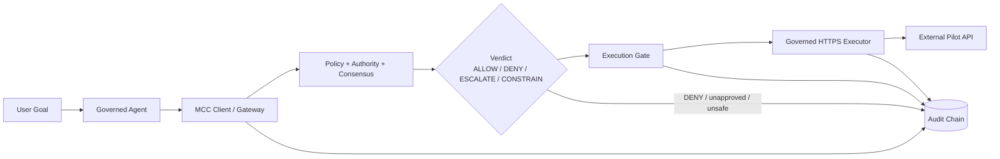

# MCC-Core Pilot v0.1 — Run the Real Governed Agent Pilot

This is the canonical guide to run, demonstrate, and validate the MCC-Core
governed agent pilot from a fresh clone, with no undocumented steps.

> Release: **MCC-Core Pilot v0.1** (`0.1.0-pilot`). See
> [RELEASE_NOTES_v0.1.0-pilot.md](RELEASE_NOTES_v0.1.0-pilot.md) and the design
> baseline in [docs/MCC_CORE_PILOT_V0_1.md](docs/MCC_CORE_PILOT_V0_1.md).

## Architecture



The agent proposes; MCC-Core decides; the execution gate enforces; the governed
HTTPS executor performs the request; the audit chain records. No verified
decision → no execution.

## Components

| Component | Location | Role |
|-----------|----------|------|
| Governed agent | `src/mcc_agent/` | Planner + supported client + orchestrator. Holds no executor/signing key; performs no outbound networking; imports no HTTP client. |
| MCC-Core runtime | `src/mcc_core/` | Authority, decision token, gate, coordinator, approvals, registries, audit. Reused — not reimplemented. |
| Governed HTTPS executor | `egress_proxy/` | The only outbound caller: SSRF + IP-pinned TLS + audit. |
| External pilot API | `pilot_api/` | Separate enterprise-style service the agent acts upon. Deterministic state; `/operations` evidence; strict schemas. |
| Redis | `redis:7-alpine` | Nonce / idempotency / velocity / approval state (fail-closed; no in-memory fallback). |

## Startup

### Option A — in-process (no Docker, no credentials)

A self-contained run: it boots the external pilot API on loopback and drives the
real runtime. Best for development and reproducible evidence.

```bash
PYTHONPATH=src python -m mcc_agent.demo            # all 9 scenarios + PASS/FAIL
PYTHONPATH=src python -m mcc_agent.demo --verdicts # the four governed verdicts, staged
PYTHONPATH=src python -m mcc_agent.demo --evidence # regenerate evidence/governed_agent_pilot/
```

### Option B — full containerized stack (one command)

```bash
docker compose -f docker-compose.pilot.yml up --build
```

This starts **redis**, **pilot-api** (external API), **mcc-gateway** (the MCC
runtime + governed HTTPS executor, with health/readiness gating), and
**mcc-agent**. Startup ordering is deterministic via health checks
(`depends_on: condition: service_healthy`). Run the demonstration:

```bash
docker compose -f docker-compose.pilot.yml run --rm mcc-agent \
    python /app/governed_agent_compose_demo.py
```

The network model isolates the agent from the external API — only the gateway's
governed executor reaches it. Optional API keys are documented in
[deploy/pilot/.env.pilot.example](deploy/pilot/.env.pilot.example); the gateway
fails closed when a selected Redis backend has no `MCC_REDIS_URL`.

## Demo — the four governed verdicts

`python -m mcc_agent.demo --verdicts` runs:

- **ALLOW** — an authorized action reaches the external pilot API.
- **DENY** — the action is rejected; the external API is not called.
- **ESCALATE** — execution is blocked until approval is submitted, then the
  action is re-evaluated and executes.
- **CONSTRAIN** — MCC clamps the proposed payload, the constrained proposal is
  re-evaluated, and only the final governed payload is executed (the original is
  never sent).

Each stage is printed (goal → proposal → authority state → verdict →
re-evaluation → execution gate → final payload → audit evidence), followed by an
audit-chain verification.

## Expected output (abridged)

```
MCC-Core Pilot v0.1  (release 0.1.0-pilot)
===== ALLOW =====
  4. Verdict          : ALLOW
  6. Execution gate   : EXECUTED
  7. Final payload    : {... 'name': 'Alice'}  (external changed: True)
===== DENY =====
  4. Verdict          : DENY
  6. Execution gate   : BLOCKED   (external changed: False)
===== ESCALATE =====
  4. Verdict          : ESCALATE
  5. Re-evaluation    : approval submitted -> re-evaluated -> executed
===== CONSTRAIN =====
  4. Verdict          : CONSTRAIN
  5. Re-evaluation    : clamped ['body.amount: 10000.0 -> 5000 (max)'] -> only constrained payload authorized
  7. Final payload    : {'amount': 5000, ...}
Audit chain verifies: True
Pilot API recorded 3 operation(s) — only authorized actions.
VERDICT DEMO PASSED
```

Inspect external state directly (containerized): `curl http://localhost:9100/operations`.

## Audit evidence

Every decision surfaces (`AgentResult.audit_evidence`): `proposal_id`, `actor`,
`resource`, `action_hash`, `payload_hash`, `policy_hash`, `authority_state`,
`verdict`, `constraints`, `execution_result`, and `audit_ref` (audit-chain
linkage). For CONSTRAIN, the `payload_hash` binds to the **clamped** body, not
the original. The audit record exists before actuation, and the append-only hash
chain verifies after the demonstration. Reproducible evidence (with a SHA-256
manifest) lives in [evidence/governed_agent_pilot/](evidence/governed_agent_pilot/).

## Troubleshooting

| Symptom | Cause / fix |
|---------|-------------|
| `ModuleNotFoundError: mcc_agent` | Run with `PYTHONPATH=src` (the package lives under `src/`). |
| In-process demo: port in use | Set `MCC_PILOT_API_PORT` to a free port. |
| `... requires MCC_REDIS_URL; refusing to fall back` | A Redis backend was selected without `MCC_REDIS_URL` — this is fail-closed by design; set the URL. |
| Containerized: `mcc-gateway` never healthy | Redis not reachable or required config missing — the gateway only reports ready when Redis + signing/trust are loaded. |
| `DEPENDENCY_UNAVAILABLE` on every action | Redis-backed registries cannot reach Redis (fail closed). |
| Replay returns `BLOCKED` immediately | Expected — a reused idempotency key / nonce executes at most once. |

## Security assumptions

- The governed HTTPS executor is the **only** supported outbound path; the agent
  cannot call the external API directly (enforced by a static import guard +
  bypass test).
- Fail-closed: missing required config, an unavailable dependency, an audit-write
  failure, an unsafe destination, or an unverified decision all yield no
  execution.
- Pilot keys/fixtures are **test-only** (ephemeral Ed25519, loopback/in-memory).
  No production secrets or personal data are committed.

## Known limitations

- The in-process pilot uses a per-action pilot `AuthorityModel` (configuration);
  the containerized gateway uses the egress proxy's host/method/amount authority.
  Both are the same MCC-Core engine, configured differently.
- Deterministic planner only (no LLM yet); ephemeral signing keys; config-level
  mandates; the Docker network boundary is a pilot illustration, not a production
  control. Production hardening: persistent/rotated keys, signed mandates at
  scale, network policy / service identity / workload isolation, HTTPS-only
  egress, and an LLM planner behind the deterministic one
  (see `docs/MCC_CORE_PILOT_V0_1.md` §9–10).
