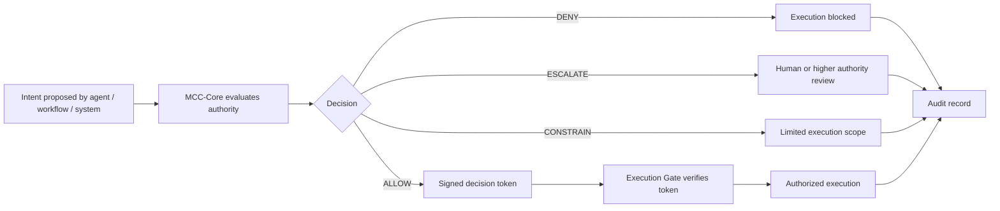

# MCC-Core: Execution Governance Infrastructure

**Public technical record established:** May 2026  
**Author:** Alexandr Ponomariov / AXLOGIQ Inc.  
**Repository:** https://github.com/mcc-prior-art/mcc-layer  
**Version:** `v1.5.0`  |  **Date:** `2026-05-25`

---

<p align="center">
  <strong>Verified execution authority for autonomous AI systems.</strong>
</p>

<p align="center">
  <strong>Intent is not authority. Memory is not authority. Execution requires a verified decision token.</strong>
</p>

<p align="center">
  <a href="https://axlogiq.com"></a>
  <a href="https://axlogiq.ai"></a>
  <a href="https://axlogiq.org"></a>
</p>

<p align="center">
  
</p>

<p align="center">
  <a href="docs/exhibits/README.md"><strong>View MCC-I Exhibits G3-G4.1 →</strong></a>
  ·
  <a href="docs/exhibits/AXLOGIQ_Governance_v2.png"><strong>View Governance Exhibit →</strong></a>
</p>

---

## Summary

**MCC-Core** is a public reference architecture and prototype runtime for execution governance in autonomous AI systems.

It defines a verifiable boundary between AI-generated intent and authorized execution.

The central question MCC-Core addresses is not whether a model can reason, but whether a proposed action is currently authorized to execute.

> Is this exact action authorized to execute, under this policy, by this actor, in this context, at this time?

MCC-Core evaluates identity, policy, action scope, context freshness, risk, token validity, replay state, and auditability before execution is allowed.

It returns one of four execution outcomes:

- **ALLOW**
- **DENY**
- **ESCALATE**
- **CONSTRAIN**

When execution is authorized, MCC-Core issues a signed, scoped, time-limited, replay-protected decision token.

The execution gate verifies the token before any action is allowed.

The audit layer records the decision and execution attempt.

---

## Architectural Contribution

MCC-Core formalizes an execution-governance pattern for autonomous systems:

> The model proposes.  
> MCC-Core evaluates.  
> The gate enforces.  
> The audit proves.

This separates reasoning from authority.

A model, agent, workflow, or automation may propose an action.

That proposal does not create permission.

Execution requires a verified decision token generated under current identity, policy, context, risk, and audit conditions.

---

## Core Principles

| Principle | Meaning |
|---|---|
| **Intent is not authority** | A proposed action is never permission to execute |
| **Memory is not authority** | Prior approvals and remembered patterns do not authorize present execution |
| **Proposal is not permission** | Agent suggestions require explicit verification |
| **Model output is not authorization** | Neural output alone does not grant execution rights |
| **Execution requires a verified decision token** | Only a signed, scoped, time-limited, replay-protected token authorizes execution |
| **Fail closed by default** | Missing, stale, invalid, or unverifiable authority blocks execution |

---

## How MCC-Core Works



---

## Execution Outcomes

| Outcome | Description | Typical Trigger |
|---|---|---|
| **ALLOW** | Action is authorized and may proceed | Current identity, policy, context, scope, risk, and token checks pass |
| **DENY** | Execution is blocked | Missing, invalid, expired, stale, replayed, or unverifiable authority |
| **ESCALATE** | Execution requires additional review | High risk, ambiguity, stale memory, policy mismatch, or privileged action |
| **CONSTRAIN** | Execution may proceed only within limits | Restricted amount, duration, destination, rate, environment, or scope |

---

## Runtime Law

MCC-Core does not infer permission.

Execution is denied unless required authority checks pass.

Core invariants:

- No identity → no execution
- No policy → no execution
- No verified decision token → no execution
- No valid decision token → no execution
- Memory without a valid token → deny
- Stale context → deny or escalate
- Used nonce → deny
- Expired token → deny
- Invalid signature → deny
- Missing audit path → deny
- Fail closed by default

---

## Memory Is Not Authority

Agent memory creates a new execution risk.

An autonomous agent may remember prior actions, historical approvals, deployment patterns, user preferences, successful workflows, or operational decisions.

That memory is informational context.

It is not execution authority.

A remembered approval must not authorize a current action unless the current action is re-evaluated under current policy, current context, and current authority.

MCC-Core therefore treats stale memory, changed policy, changed context, and missing token state as execution-governance risks.

---

## Example: Stale Memory in Infrastructure

An infrastructure agent attempts to run a production deployment based on remembered approval.

```text
action: terraform_apply
target: production_cluster
environment: production
actor: infra_agent
memory_policy: infra-policy-v3
current_policy: infra-policy-v4
memory_ctx: ctx_91f3a8
current_ctx: ctx_b72c19
```

Detected mismatch:

```text
policy_version_mismatch
context_hash_mismatch
```

Decision:

```text
OUTCOME: ESCALATE
token_issued: false
execution_allowed: false
```

Result:

The action is not automatically executed.

The system preserves an audit record and routes the action for human or higher-authority review.

Related exhibits:

- [MCC-I Exhibits G3-G4.1](docs/exhibits/README.md)

---

## Quick Start

Clone the repository:

```bash
git clone https://github.com/mcc-prior-art/mcc-layer.git
cd mcc-layer
```

Run the minimal runtime proof:

```bash
python examples/mcc_runtime_proof.py
```

Expected behavior:

```text
WITHOUT MCC:
EXECUTED: user deleted

WITH MCC:
BLOCKED: Destructive action blocked
```

Run the API server locally:

```bash
pip install -r requirements.txt
uvicorn main:app --host 0.0.0.0 --port 8000
```

Run with Docker Compose:

```bash
docker compose up --build
```

Then open:

```text
http://localhost:8000
```

Example API request:

```bash
curl -X POST http://localhost:8000/evaluate \
  -H "Content-Type: application/json" \
  -d '{
    "actor": "infra_agent",
    "action": "terraform_apply",
    "target": "production_cluster",
    "environment": "production",
    "memory_policy": "infra-policy-v3",
    "current_policy": "infra-policy-v4",
    "memory_ctx": "ctx_91f3a8",
    "current_ctx": "ctx_b72c19"
  }'
```

Representative response:

```json
{
  "outcome": "ESCALATE",
  "reason_code": "STALE_MEMORY_CONTEXT_MISMATCH",
  "token_issued": false,
  "execution_allowed": false,
  "audit_recorded": true
}
```

---

## Existing Examples

| File | Purpose |
|---|---|
| `examples/mcc_runtime_proof.py` | Minimal proof that MCC blocks dangerous tool execution |
| `examples/agent_runtime_mcc.py` | Agent runtime example with MCC gating |
| `examples/prompt_injection_vs_mcc.py` | Prompt-injection scenario versus execution governance |
| `examples/agent_tool_gateway.json` | Example tool-gateway profile |
| `examples/cloud_execution_profile.json` | Cloud execution profile |
| `examples/robotics_profile.json` | Robotics execution profile |

Recommended first review path:

1. Read this README.
2. Run `examples/mcc_runtime_proof.py`.
3. Review `docs/DECISION_TOKEN.md`.
4. Review `docs/AUDIT_MODEL.md`.
5. Review `docs/ROADMAP.md`.
6. Review `docs/exhibits/README.md`.

---

## Integration Patterns

MCC-Core can be implemented as a pre-execution authority layer in several patterns:

| Pattern | Description |
|---|---|
| **Sidecar** | Runs next to an agent, service, workflow runner, or automation tool |
| **API Gateway / Tool Gateway** | Sits between an AI system and external tools or APIs |
| **CI/CD Gate** | Evaluates deployments, infrastructure changes, Terraform applies, and privileged pipeline actions |
| **Policy Engine Bridge** | Connects runtime requests to policy systems such as OPA/Rego |
| **Audit Boundary** | Records decisions, denied attempts, escalations, and constrained actions before actuation |
| **Embedded Runtime** | Runs inside controlled agent systems or enterprise automation layers |

The common rule:

> Execution is allowed only after verified authority is produced and accepted by the gate.

---

## Security Model

MCC-Core is designed around a fail-closed posture.

The system denies or escalates execution when it cannot verify authority.

Security-relevant checks include:

- identity verification
- policy version matching
- context freshness
- token signature validation
- token expiration
- nonce / replay protection
- audit path availability
- action scope validation
- risk classification
- approval state validation

The audit model supports audit-before-actuation and immutable evidence generation.

See:

- [Security Model](docs/SECURITY_MODEL.md)
- [Audit Model](docs/AUDIT_MODEL.md)
- [Decision Token](docs/DECISION_TOKEN.md)
- [Policy Trust Set](docs/POLICY_TRUST_SET.md)

---

## Technical Advantages

MCC-Core provides:

- explicit separation between intent and execution authority
- fail-closed decisioning
- signed decision token model
- scoped and time-limited execution authorization
- nonce-based replay protection
- policy-aware action evaluation
- stale-memory prevention
- audit-before-actuation
- constrained execution outcomes
- human escalation path for ambiguous or high-risk actions
- reference architecture for AI execution governance

---

## Roadmap

| Area | Status |
|---|---|
| Public architecture doctrine | Complete |
| Core execution governance canon | Complete |
| Decision outcomes: `ALLOW / DENY / ESCALATE / CONSTRAIN` | Complete |
| Decision token model | Complete |
| MCC-I exhibits G3-G4.1 | Complete |
| Policy examples | Complete |
| Working reference runtime | Prototype |
| OPA / Rego integration | Prototype |
| Redis nonce / replay state | Prototype |
| Docker Compose local environment | Prototype |
| API server reference shape | Prototype / evolving |
| Production-hardened runtime | Planned |
| Signed policy bundle supply chain | Planned |
| Distributed nonce registry | Planned |
| Independent technical review | Planned |
| External security review | Planned |
| Certification review, where applicable | Future / not claimed |

Roadmap items are planning signals, not claims of current production readiness.

---

## Documentation Map

| Document | Purpose |
|---|---|
| [Architecture](docs/ARCHITECTURE.md) | Core architecture model |
| [Decision Token](docs/DECISION_TOKEN.md) | Decision token model and authority artifact |
| [Audit Model](docs/AUDIT_MODEL.md) | Audit-before-actuation and evidence model |
| [Policy Trust Set](docs/POLICY_TRUST_SET.md) | Policy trust and version control model |
| [OPA Integration](docs/OPA_INTEGRATION.md) | OPA/Rego integration direction |
| [Security Model](docs/SECURITY_MODEL.md) | Fail-closed security posture |
| [Limitations](docs/LIMITATIONS.md) | Boundaries and non-claims |
| [Use Cases](docs/USE_CASES.md) | Example execution surfaces |
| [Roadmap](docs/ROADMAP.md) | Current and planned work |
| [MCC-I Exhibits](docs/exhibits/README.md) | G3-G4.1 public exhibit package |

---

## Public Technical Record

This repository functions as a public technical record for:

- MCC — Meta-Cognitive Control
- MCC-Core
- MCC-I
- Memory-Authority Boundary
- Verified Execution Authority
- Execution Governance Infrastructure
- AXLOGIQ Inc. architecture doctrine
- Reference implementation direction
- Exhibit documentation

Key exhibit package:

- [MCC-I Exhibits G3-G4.1](docs/exhibits/README.md)

Key governance exhibit:

- [AXLOGIQ Governance v2](docs/exhibits/AXLOGIQ_Governance_v2.png)

---

## Project Identity

- Company: **AXLOGIQ Inc.**
- Architecture: **MCC — Meta-Cognitive Control**
- Technical Runtime: **MCC-Core**
- Infrastructure Vertical: **MCC-I**
- Founder & Architect: **Alexandr Ponomariov**
- Repository: `github.com/mcc-prior-art/mcc-layer`
- Corporate Site: `www.axlogiq.com`
- Technical Product Site: `axlogiq.ai`
- Public Architecture Record: `axlogiq.org`

---

## Official Resources

- Corporate: `https://www.axlogiq.com`
- Technical Product: `https://axlogiq.ai`
- Public Architecture Record: `https://axlogiq.org`
- GitHub Reference: `https://github.com/mcc-prior-art/mcc-layer`
- MCC-I Exhibits: `docs/exhibits/README.md`

---

## Accurate Positioning

Correct descriptions:

- AXLOGIQ's execution governance architecture
- MCC-Core public reference architecture and reference implementation
- Verified decision boundary between intent and action
- Execution governance infrastructure for autonomous AI systems
- Public technical record — Alexandr Ponomariov / AXLOGIQ Inc.
- Prototype runtime for technical review, simulation, local testing, and integration design
- Verified execution authority layer for autonomous systems

Do not describe as:

- Certified production safety system
- Government-approved or endorsed
- Independently audited or formally verified
- Production-proven at scale
- Guaranteed prevention system
- Replacement for enterprise security, legal, compliance, or operational controls
- Generic AI safety product

---

## Claim Hygiene

This repository describes a public reference architecture and prototype implementation for technical review, simulation, local testing, enterprise PoC design, and integration review.

It does not claim:

- production certification
- government approval
- certified safety status
- formal audit completion
- production deployment at scale
- guaranteed prevention of all failures
- replacement for enterprise security, legal, compliance, or operational controls

MCC-Core and MCC-I are presented as public reference architecture and prototype / technical review materials.

---

## Status

Prepared: **May 2026**  
Classification: **Public Reference Architecture**  
Status: **Prototype / Technical Review**

---

<p align="center">
  <strong>VERIFY THE DECISION. CONTROL THE EXECUTION. AUDIT THE OUTCOME.</strong>
</p>
