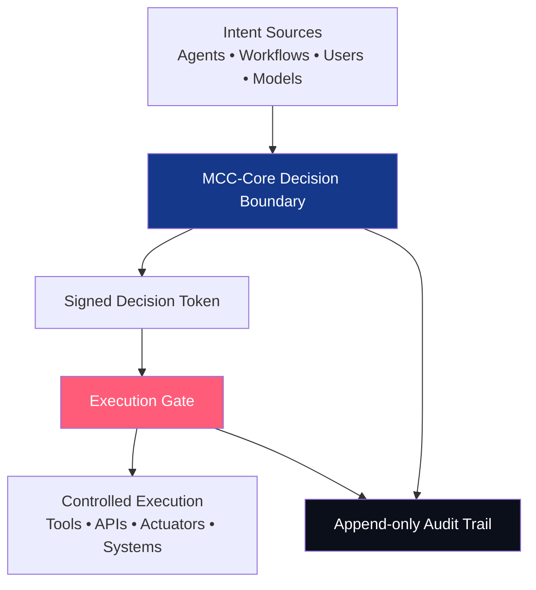
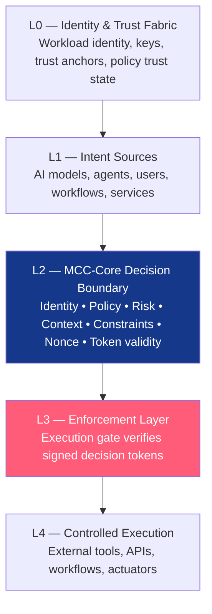
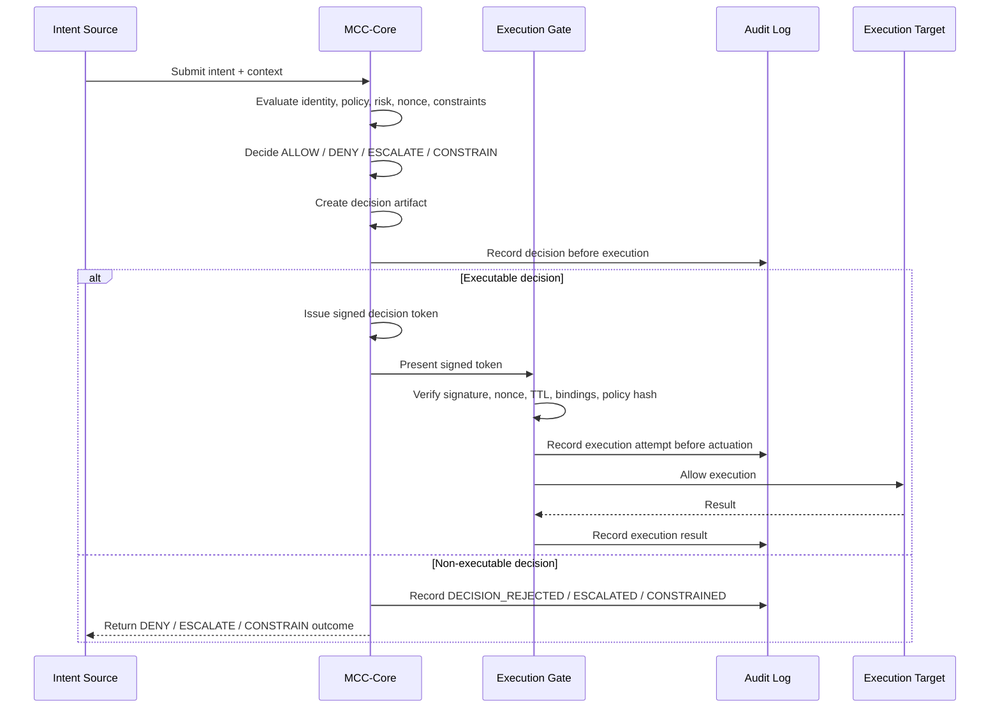

# MCC-Core

<p align="center">
  <strong>Execution Governance Infrastructure for Autonomous AI Systems</strong>
</p>

<p align="center">
  <strong>Autonomy without verifiable control is not intelligence.</strong><br>
  <strong>Intent is not authority. Execution requires a verified decision.</strong>
</p>

<p align="center">
  <a href="https://axlogiq.com"></a>
  <a href="https://axlogiq.ai"></a>
  <a href="https://axlogiq.org"></a>
</p>

<p align="center">
  
  
  
  
  
  
</p>

---

## Executive Summary

**MCC-Core** is a public reference architecture and prototype runtime for **verified execution governance** in autonomous AI systems.

As AI systems move from generating answers to executing actions, the critical infrastructure problem changes.

The question is no longer only:

> Can the model reason?

The execution question is:

> Is this exact action authorized to execute, under this policy, by this actor, in this context, at this time?

MCC-Core defines the decision boundary between **AI-generated intent** and **authorized execution** by verifying identity, policy, risk, context, constraints, token validity, replay state, and auditability **before** action is allowed.

Core principle:

> Intent is not authority.  
> Proposal is not permission.  
> Model output is not authorization.  
> **Execution requires a verified decision.**  
> **No verified decision — no execution.**

MCC-Core produces explicit execution outcomes:

```text
ALLOW / DENY / ESCALATE / CONSTRAIN
```

When execution is authorized, MCC-Core issues a signed, scoped, time-limited, replay-protected decision token.

The execution gate does not infer permission.

It verifies authority.

This repository contains the **public reference architecture**, doctrine, runtime model, and roadmap toward **MCC-Core API Server v0.1**.

It is intended for technical review, simulation, OPA/Rego integration testing, and enterprise PoC design.

**Current status:** Public reference architecture and prototype. MCC-Core API Server v0.1 is planned.

This is **not** a certified production system, a formally audited security product, or a government-approved solution.

---

## Web Presence

AXLOGIQ separates company identity, technical product reference, and public architecture record across three domains.

| Domain | Role |
|---|---|
| [axlogiq.com](https://axlogiq.com) | Corporate landing — company-level positioning, founder profile, platform vision, and high-level execution governance narrative. |
| [axlogiq.ai](https://axlogiq.ai) | MCC-Core technical product site — decision tokens, fail-closed gates, replay protection, OPA/Rego adapter, and audit model. |
| [axlogiq.org](https://axlogiq.org) | Public architecture record — timestamped record of the MCC doctrine, architecture, authorship, positioning, and reference repository. |

---

## Table of Contents

- [Web Presence](#web-presence)
- [What MCC-Core Is](#what-mcc-core-is)
- [Why MCC-Core Exists](#why-mcc-core-exists)
- [Core Thesis](#core-thesis)
- [Architecture](#architecture)
- [Architecture Layers](#architecture-layers)
- [Runtime Flow](#runtime-flow)
- [Decision Outcomes](#decision-outcomes)
- [Runtime Law](#runtime-law)
- [Decision Token](#decision-token)
- [OPA / Rego Policy Adapter](#opa--rego-policy-adapter)
- [Security Model](#security-model)
- [Audit Model](#audit-model)
- [Manual Review Model](#manual-review-model)
- [MCC-Core API Server v0.1 (Planned)](#mcc-core-api-server-v01-planned)
- [Why Not Just Use OPA, SPIFFE, IAM, or Existing Policy Engines?](#why-not-just-use-opa-spiffe-iam-or-existing-policy-engines)
- [Design Doctrine](#design-doctrine)
- [Reference Repository Structure](#reference-repository-structure)
- [Reference Runtime Scope](#reference-runtime-scope)
- [Example Decision Request](#example-decision-request)
- [Productization Directions](#productization-directions)
- [Testing Philosophy](#testing-philosophy)
- [Public Technical Review Status](#public-technical-review-status)
- [Accurate Positioning](#accurate-positioning)
- [Project Identity](#project-identity)
- [Founder / Architect](#founder--architect)
- [License](#license)

---

## What MCC-Core Is

MCC-Core is the technical runtime and reference implementation of **MCC — Meta-Cognitive Control**.

MCC defines an **execution governance boundary** for autonomous AI systems.

It sits between intent generation and real-world action, evaluating identity, policy output, risk, context, constraints, token validity, replay state, and auditability before issuing a verifiable execution decision.

If execution is not explicitly authorized, it does not happen.

MCC-Core does **not** replace:

- the model;
- the workflow or agent framework;
- the human reviewer;
- the policy engine;
- the identity provider;
- the execution system;
- certified functional safety systems.

MCC-Core governs the boundary between **intent** and **execution**.

---

## Why MCC-Core Exists

AI systems are crossing from advisory into operational roles.

The primary risk is no longer only incorrect answers.

The deeper risk is **unauthorized execution** of AI-generated intent.

Examples of execution surfaces:

- an agent sends an external email or message;
- a workflow updates production data;
- a payment agent initiates a transfer;
- a procurement agent approves a purchase order;
- a cloud agent modifies IAM or infrastructure;
- a tool-using model runs shell commands;
- a software agent deletes files;
- an autonomous workflow invokes privileged APIs;
- a robot or physical actuator performs movement.

In operational environments, the final risk point is not the prompt, the plan, or the model response.

The final risk point is execution.

That is where intent becomes action: money moves, infrastructure changes, data mutates, APIs fire, or physical systems operate.

MCC-Core exists to make execution governance explicit, verifiable, auditable, and enforceable at that final risk boundary.

---

## Core Thesis

> The model proposes.  
> MCC-Core evaluates.  
> The gate enforces.  
> The audit proves.

Proposal is not permission.  
Model output is not authorization.  
Neural confidence is not a license to act.

Every autonomous system requires a verifiable boundary between intent and execution.

That boundary is MCC.

---

## Architecture

MCC-Core separates **proposal** from **authority**.

Agents, workflows, services, or users may request an action, but execution only occurs after a verifiable decision is produced, scoped, signed, audited, and enforced at the gate.



---

## Architecture Layers



### L0 — Identity & Trust Fabric

Foundation layer for workload identity, trust anchors, key material, tenant context, service identity, and policy trust state.

MCC-Core assumes execution authority must be bound to a known actor, service, tenant, workload, or device context.

A valid identity is not automatically trusted for execution. Identity is necessary but not sufficient: a valid actor may still request an unauthorized action, exceed scope, reuse an expired decision, or operate under a revoked policy state.

Root-of-trust assumptions, signing keys, trusted issuers, and policy trust state must be explicit, inspectable, and revocable.

### L1 — Intent Sources

AI models, agents, users, workflows, services, controllers, applications, schedulers, and orchestration systems may propose actions.

### L2 — MCC-Core Decision Boundary

Evaluates identity, policy, risk, context, payload, scope, constraints, approvals, nonce state, token validity, policy trust, and auditability.

### L3 — Enforcement Layer

Execution gate verifies signed decision tokens before allowing action.

### L4 — Controlled Execution

External tools, APIs, workflows, operational systems, or actuators execute only after verified authorization.

---

## Runtime Flow

```text
Evaluate → Decide → Tokenize → Enforce → Audit
```

1. **Evaluate** identity, policy, risk, context, constraints, policy trust, and replay state.
2. **Decide** with an explicit execution outcome.
3. **Tokenize** the decision into a signed, scoped, time-limited decision token.
4. **Enforce** at the execution gate.
5. **Audit** before actuation.

Canonical flow:



---

## Decision Outcomes

Every intent resolves to one of four explicit decisions:

| Outcome | Meaning |
|---|---|
| `ALLOW` | Execution is authorized within verified scope, policy, payload, identity, constraints, and time window. |
| `DENY` | Execution is blocked. Missing, invalid, risky, stale, unavailable, or unverifiable authority fails closed. |
| `ESCALATE` | Execution requires additional approval, human review, quorum, or privileged authorization. |
| `CONSTRAIN` | Execution may proceed only under explicit limits such as amount, speed, duration, destination, or scope. |

No ambiguity at execution time.

---

## Runtime Law

```text
No verified decision — no execution.
```

Execution invariants:

- No identity → no execution
- No policy → no execution
- No verified decision → no execution
- No valid decision token → no execution
- No audit → no trust
- Used nonce → deny
- Policy mismatch → deny
- OPA unavailable → deny
- Expired token → deny
- Invalid signature → deny
- Unknown action → deny
- Untrusted scope → deny
- Missing audit path → deny
- Fail closed by default

These invariants are the runtime law of MCC-Core.

---

## Decision Token

Authority is a **verifiable object**, not an assumption.

A signed decision token binds execution authority to a verified, scoped, time-limited decision.

The gate does not infer permission.

It verifies authority.

Example decision token payload:

```json
{
  "iss": "mcc/node-a",
  "kid": "mcc-node-a-key-1",
  "sub": "agent/payment-worker",
  "aud": "execution-gate-1",
  "action": "create_payment",
  "payload_hash": "sha256:...",
  "action_hash": "sha256:...",
  "policy_id": "prod/v1",
  "policy_hash": "sha256:...",
  "policy_ref": "mcc.rego/send_payment/escalate",
  "nonce": "single-use-uuid",
  "nbf": 1760000000,
  "exp": 1760000060,
  "constraints": {
    "max_amount_usd": 500
  },
  "audit_ref": "audit://..."
}
```

The JSON payload above is **not** authority by itself. It becomes enforceable only when it is canonically serialized, signed by a trusted MCC authority key, and verified by the execution gate.

Reference signature envelope:

```text
decision_token = canonical_payload + signature
signature      = Sign(canonical_payload, trusted_mcc_authority_key)
verify         = Verify(signature, canonical_payload, trusted_key_set)
```

Token fields:

| Field | Purpose |
|---|---|
| `iss` | MCC authority issuing the decision token. |
| `kid` | Trusted signing key identifier. |
| `sub` | Actor requesting or executing the action. |
| `aud` | Intended execution gate. |
| `action` | Runtime action being authorized. |
| `payload_hash` | Binds decision to the exact payload; tampering invalidates authority. |
| `action_hash` | Binds authority to the specific action being executed. |
| `policy_id` | Policy identifier used during evaluation. |
| `policy_hash` | Ensures policy state at decision time matches verification. |
| `policy_ref` | Links the decision to the evaluated policy branch. |
| `nonce` | Single-use replay protection. |
| `nbf` / `exp` | Short validity window. |
| `constraints` | Explicit limits attached to the decision. |
| `audit_ref` | Links to append-only audit evidence. |

---

## OPA / Rego Policy Adapter

Policy evaluation is integrated.

Execution authority remains separate.

MCC-Core is designed to integrate with OPA/Rego as a policy-evaluation adapter. OPA evaluates policy. MCC-Core binds the policy result into execution authority together with runtime context, token validity, replay protection, constraints, policy trust, and audit-before-actuation.

When enabled, MCC-Core may call OPA at:

```text
/v1/data/mcc/decision
```

and convert the result into:

```text
ALLOW / DENY / ESCALATE / CONSTRAIN
```

If OPA is unavailable, times out, returns invalid output, omits a result, or returns an invalid decision, MCC-Core fails closed to `DENY`.

```text
OPA decides policy.
MCC-Core governs execution authority.
The execution gate enforces the verified decision.
```

---

## Security Model

MCC-Core follows a strict **fail-closed** posture.

Uncertainty does not authorize execution.

Every verification failure results in denial.

### Deny by Default

Missing, ambiguous, stale, invalid, unavailable, or unverifiable authority state denies execution.

There is no permissive fallback.

### Policy Engine Fail-Closed

OPA timeout, unreachable service, missing result, invalid JSON, or invalid decision resolves to `DENY`.

### Signature Verification

Decision tokens are verified against trusted authority keys.

Invalid, revoked, or unknown keys deny execution.

### Replay Protection

Single-use nonces prevent token reuse.

Distributed deployments require shared nonce state.

### Canonical Binding

Payload, action, policy, identity, audience, constraints, and time-window binding prevent request substitution and scope drift.

### Policy Trust Set

Only accepted policy versions authorize execution.

Mismatch, revocation, or expiry resolves to denial.

### Audit Dependency

If the system cannot record the required audit event before execution, execution must fail closed.

---

## Audit Model

**Audit before actuation. Always.**

Audit is mandatory and cannot be bypassed.

The execution flow records an audit event **before** the actuator, external tool, API, or operational system is invoked.

Audit evidence is append-only and hash-chain friendly.

Reference audit sequence:

1. `VERIFY_POLICY`
2. `VERIFY_TOKEN`
3. `DECISION_RECORDED`
4. `EXECUTION_ATTEMPT`
5. `EXECUTION_REJECTED`
6. `EXECUTION_SUCCEEDED`
7. `EXECUTION_FAILED`
8. `EXECUTION_EXCEPTION`

Stronger implementations should use tamper-evident hash chaining:

```text
entry_hash = hash(previous_hash + canonical_entry)
```

This makes the audit log verifiable and resistant to silent mutation.

---

## Manual Review Model

Manual review must **not** mutate the original decision.

If an action is escalated, the escalated decision remains part of the immutable audit history.

When a reviewer approves or rejects, MCC-Core creates a **new signed decision** linked to the original.

Correct model:

- Decision A: `outcome = ESCALATE`, `executed = false`, signed
- Human review approves
- Decision B: `outcome = ALLOW`, `parent_decision_id = Decision A`, `reviewer_id`, signed, executable

Incorrect model:

- Decision A: `outcome = ESCALATE`
- SQL `UPDATE approved = true` on the original record

The review process must preserve audit integrity.

---

## MCC-Core API Server v0.1 (Planned)

This repository is being developed toward **MCC-Core API Server v0.1**.

The API server is a callable HTTP runtime interface around the MCC-Core execution governance model. Its purpose is to make MCC-Core testable through real API calls.

**Important:** The API server described below is planned. The endpoints define the intended v0.1 reference API shape and should be treated as the implementation target until matching server files are present in the repository.

Reference flow:

```text
Intent → MCC-Core Evaluation → Signed Decision Token → Execution Gate → Audit
```

### Planned Responsibilities

- Structured intent intake
- Optional LLM-based intent extraction — extraction only, never execution
- Policy evaluation
- Signed decision token issuance
- Execution gate verification
- Nonce / replay protection
- Append-only audit log
- Manual review flow
- Fail-closed behavior
- Testable decision outcomes

### Reference Endpoints

| Endpoint | Purpose |
|---|---|
| `POST /v1/intent` | Optional LLM-based conversion of user message into structured intent. |
| `POST /v1/decide` | Evaluates structured intent → ALLOW / DENY / ESCALATE / CONSTRAIN. |
| `POST /v1/execute` | Executes only when a valid signed decision token is provided. |
| `POST /v1/review` | Creates a new signed decision after human review. |
| `GET /v1/audit` | Returns audit records and decision history. |
| `GET /health` | Service health. |

### Key API Rule

LLM output is never treated as authority.

```text
LLM extracts intent.
MCC-Core decides.
Execution Gate enforces.
```

---

## Why Not Just Use OPA, SPIFFE, IAM, or Existing Policy Engines?

MCC-Core is **not** a policy engine, identity system, agent framework, observability layer, or functional safety system.

It is the **execution decision boundary** that turns identity, policy, risk, context, constraints, token validity, replay protection, and audit evidence into **one enforceable runtime decision** before real-world execution.

MCC-Core does not ask only:

> Is this allowed by policy?

It asks:

> Is this actor authorized to execute this exact action, with this payload, under this policy, in this context, within this time window, with a valid token, unused nonce, enforceable constraints, and audit evidence before execution?

MCC-Core is complementary to existing systems.

| System | Role | MCC-Core Position |
|---|---|---|
| OPA / Rego | Policy evaluation | MCC-Core uses policy evaluation as an input and binds it to execution authority. |
| SPIFFE / SPIRE | Workload identity | Identity is necessary but not sufficient for authorizing a specific action. |
| IAM / RBAC / ABAC | Access control | Access is not execution governance. MCC-Core evaluates concrete execution attempts at runtime. |
| Agent frameworks | Planning and orchestration | Agent frameworks propose and route actions. MCC-Core gates execution. |
| Observability | Logs, traces, monitoring | Logging after execution is too late. MCC-Core controls whether execution is allowed. |
| Functional safety systems | Hardware limits and emergency control | MCC-Core does not replace certified safety systems. It governs AI action authority before execution. |

---

## Design Doctrine

Ten principles of verifiable execution governance:

### 1. Intent is not authority

A generated plan, model output, API call, workflow step, or agent decision is not automatically authorized to execute.

### 2. Execution requires a verified decision

Before execution, the system must produce a verifiable authority decision based on identity, policy, risk, context, constraints, approval state, and token validity.

### 3. Fail closed by default

Missing, ambiguous, stale, invalid, mismatched, expired, or unverifiable state denies execution.

Uncertainty is not permission.

### 4. Bind decisions to scope

Authority must be bound to action, payload, policy, identity, audience, constraints, time window, and nonce.

### 5. Audit before actuation

Execution attempts must be recorded in an append-only audit chain before the actuator, external tool, API, or operational system is invoked.

### 6. Separate proposal from authority

The system that proposes an action should not automatically possess execution authority.

Proposal and authorization are separate concerns.

### 7. Internal does not mean authorized

An internal agent, service, workflow, or controller may still be compromised, misconfigured, unauthorized, or operating outside approved scope.

### 8. Used nonce — deny

Token nonces are single-use.

Replay attempts are denied at the gate regardless of token validity in all other dimensions.

### 9. Override is not bypass

Emergency recovery paths must be explicitly authorized, signed, time-limited, nonce-protected, operator-bound, and auditable.

### 10. Make uncertainty non-permissive

When the system cannot verify the authority state, it should not allow execution by default.

Uncertainty resolves to denial.

---

## Reference Repository Structure

Target structure for MCC-Core API Server v0.1:

```text
mcc-layer/
├── README.md
├── Dockerfile
├── docker-compose.yml
├── requirements.txt
├── mcc_core/
│   ├── __init__.py
│   ├── core.py
│   ├── tokens.py
│   ├── audit.py
│   ├── policy.py
│   ├── gate.py
│   └── review.py
├── server/
│   ├── app.py
│   ├── models.py
│   └── intent_client.py
├── policies/
│   └── mcc.rego
├── examples/
├── tests/
└── docs/
    ├── architecture.md
    ├── threat-model.md
    └── api-server-v0.1.md
```

---

## Reference Runtime Scope

This README intentionally distinguishes between current public reference architecture and planned runtime evolution.

The repository should be evaluated against the runtime artifacts actually present in the public record, including source files, policy files, tests, examples, documentation, and release history.

If Docker Compose, API server endpoints, signed token flows, nonce registry, or hash-chain audit are added in later revisions, they should be documented with matching files and commands.

This keeps the public record accurate.

---

## Example Decision Request

```json
{
  "actor": "agent/payment-worker",
  "action": "create_payment",
  "payload": {
    "amount_usd": 750,
    "recipient": "vendor_123"
  },
  "context": {
    "environment": "production",
    "risk_level": "medium"
  }
}
```

Possible result:

```json
{
  "decision": "ESCALATE",
  "reason": "payment exceeds autonomous threshold",
  "constraints": {
    "requires_human_approval": true
  }
}
```

---

## Productization Directions

MCC-Core is the infrastructure layer. AXLOGIQ may build vertical execution-governance products on top.

### ProcureGuard AI

**ProcureGuard AI** is an agentic procurement control system powered by MCC-Core.

It governs procurement intent before purchase orders are issued, change orders are approved, or vendor commitments are activated.

ProcureGuard AI may evaluate:

- purchase requests;
- vendor selection;
- budget exceptions;
- change orders;
- supplier substitutions;
- approval thresholds;
- project cost-code alignment;
- delegated authority limits;
- procurement auditability.

```text
ProcureGuard AI is a pre-execution procurement control agent powered by MCC-Core.
```

### MCC-I — Infrastructure & Cloud

**MCC-I** is an infrastructure and cloud execution governance direction powered by MCC-Core.

It may govern Terraform, Kubernetes, IAM changes, CI/CD, cloud APIs, shell commands, production changes, and privileged actions.

```text
MCC-I provides verified execution governance for infrastructure and cloud agents.
```

### PayGuard

**PayGuard** is a payments and financial execution governance direction powered by MCC-Core.

It may govern payment intent, recipient verification, amount thresholds, approval requirements, suspicious transaction patterns, account scope, execution token verification, and audit trails for financial actions.

```text
PayGuard applies MCC-Core to payment and financial execution control.
```

Principle:

```text
Build the agent to prove the layer.
Sell the layer to scale beyond the agent.
```

---

## Testing Philosophy

Tests are proof of runtime law.

Required test categories:

- ALLOW / DENY / ESCALATE / CONSTRAIN behavior
- Signed token required before execution
- Invalid signature denied
- Expired token denied
- Used nonce denied
- Policy mismatch denied
- OPA unavailable → denied
- Audit-before-actuation enforced
- Manual review creates a new signed decision and does not mutate the original
- Unknown actions fail closed
- Missing audit path denies execution

Goal:

> Prove that the system refuses to execute when authority is missing.

---

## Public Technical Review Status

This repository is maintained as a **public technical record and reference implementation** for MCC-Core.

It is intended for technical review, simulation, and enterprise PoC design.

The core doctrine is stable:

> Intent is not authority.  
> Execution requires a verified decision.  
> No verified decision — no execution.  
> Fail closed by default.

Changes affecting doctrine, authority model, runtime law, or fail-closed posture are treated as architecture-level revisions.

---

## Accurate Positioning

Accurate descriptions:

- AXLOGIQ’s execution governance architecture / product direction
- MCC-Core public reference architecture and reference implementation
- Execution governance model for autonomous AI systems
- Verifiable decision boundary between intent and action
- Technical prototype for review, simulation, and discussion
- Public technical record — Alexandr Ponomariov / AXLOGIQ

Do not describe as:

- certified production safety system;
- government-approved or endorsed;
- adopted by xAI or any named organization;
- independently audited or formally verified;
- industry standard or certified compliance product;
- production-proven at scale.

---

## Project Identity

**Company / Project:** AXLOGIQ Inc.  
**Architecture / Product Direction:** MCC — Meta-Cognitive Control  
**Technical Runtime:** MCC-Core  
**Founder & Architect:** Alexandr Ponomariov  
**Status:** Public reference architecture / prototype  
**Initial Public Prior-Art Release:** April 22, 2026  
**Public Architecture Record:** May 2026  
**Repository:** github.com/mcc-prior-art/mcc-layer  
**Public Record:** axlogiq.org  
**Technical Product Site:** axlogiq.ai  
**Corporate Site:** axlogiq.com

---

## Founder / Architect

**Alexandr Ponomariov**  
Founder & Architect, AXLOGIQ Inc.  
Architect of MCC — Meta-Cognitive Control  
Creator of the MCC-Core reference runtime  
Creator of the ProcureGuard AI product concept

---

## License

Rights and licensing are defined by the applicable repository license.

Use of this repository does not imply certification, warranty, production readiness, regulatory approval, or suitability for safety-critical deployment.

---

## Footer Principle

**Autonomy without verifiable control is not intelligence.**

**Intent is not authority.**

**Execution requires a verified decision.**

**No verified decision — no execution.**

---

**VERIFY EVERY INTENT. CONTROL EVERY ACTION. BUILD TRUSTED AUTONOMY.**
