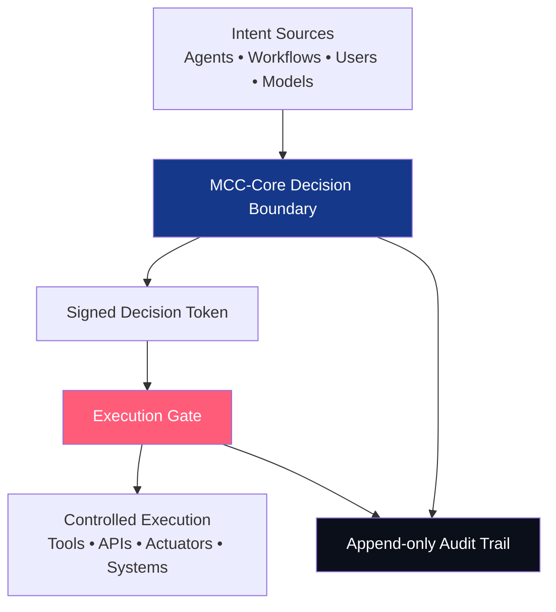
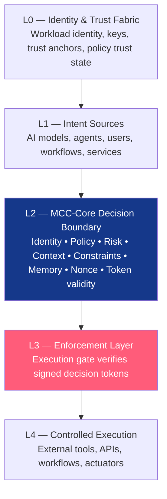
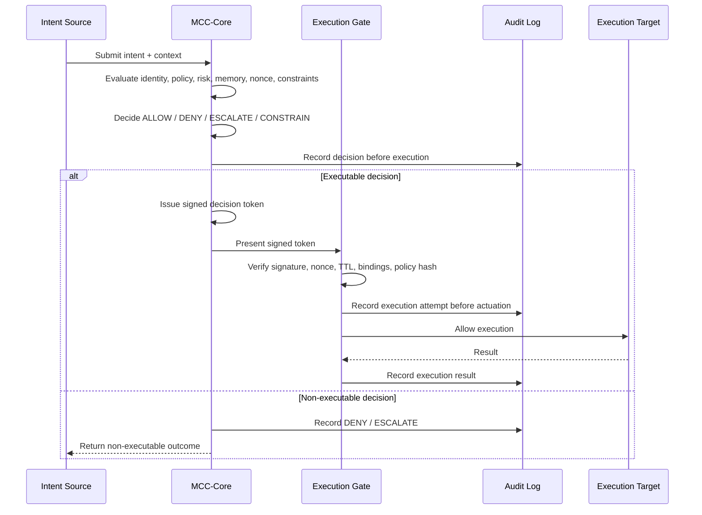

# MCC-Core

<p align="center">
  <strong>Execution Governance Infrastructure for Autonomous AI Systems</strong>
</p>

<p align="center">
  <strong>Autonomy without verifiable control is not intelligence.</strong>
</p>

<p align="center">
  <strong>Intent is not authority. Memory is not authority. Execution requires a verified decision.</strong>
</p>

<p align="center">
  <a href="https://axlogiq.com"></a>
  <a href="https://axlogiq.ai"></a>
  <a href="https://axlogiq.org"></a>
</p>

<p align="center">
  
  
  
  
  
  
</p>

---

## Executive Summary

**MCC-Core** is a public reference architecture and minimal reference runtime for **verified execution governance** in autonomous AI systems.

As AI systems move from generating answers to executing actions, the critical infrastructure problem changes.

The question is no longer only:

> Can the model reason?

The execution question is:

> Is this exact action authorized to execute, under this policy, by this actor, in this context, at this time?

MCC-Core defines the verified boundary between **AI-generated intent** and **authorized execution** by verifying identity, policy, risk, context, constraints, token validity, replay state, memory state, and auditability before action is allowed.

Core principle:

```text
Intent is not authority.
Proposal is not permission.
Model output is not authorization.
Memory is not authority.
Execution requires a verified decision.
No verified decision — no execution.
```

MCC-Core produces explicit execution outcomes:

```text
ALLOW / DENY / ESCALATE / CONSTRAIN
```

When execution is authorized, MCC-Core issues a signed, scoped, time-limited, replay-protected decision token.

The execution gate does not infer permission.

It verifies authority.

This repository contains the public reference architecture, doctrine, runtime model, MCC-I infrastructure vertical, exhibit materials, and MCC-Core API Server v0.1 reference direction.

**Current status:** Public reference architecture + minimal runnable reference implementation for local testing and technical review.

This is **not** a certified production system, a formally audited security product, or a government-approved solution.

---

## Web Presence

AXLOGIQ separates company identity, technical product reference, and public architecture record across three domains.

| Domain | Role |
|---|---|
| [axlogiq.com](https://axlogiq.com) | Corporate landing — company-level positioning, founder profile, platform vision, and high-level execution governance narrative. |
| [axlogiq.ai](https://axlogiq.ai) | MCC-Core technical product site — decision tokens, fail-closed gates, replay protection, OPA/Rego adapter, and audit model. |
| [axlogiq.org](https://axlogiq.org) | Public architecture record — timestamped record of the MCC doctrine, architecture, authorship, positioning, and reference repository. |

---

## Table of Contents

- [Executive Summary](#executive-summary)
- [Web Presence](#web-presence)
- [What MCC-Core Is](#what-mcc-core-is)
- [Why MCC-Core Exists](#why-mcc-core-exists)
- [Core Thesis](#core-thesis)
- [Memory Is Not Authority](#memory-is-not-authority)
- [Exhibits: Memory Is Not Authority](#exhibits-memory-is-not-authority)
- [Architecture](#architecture)
- [Architecture Layers](#architecture-layers)
- [Runtime Flow](#runtime-flow)
- [Decision Outcomes](#decision-outcomes)
- [Runtime Law](#runtime-law)
- [Decision Token](#decision-token)
- [MCC-Core API Server v0.1](#mcc-core-api-server-v01)
- [Quickstart](#quickstart)
- [Why Not Just Use OPA, SPIFFE, IAM, or Existing Policy Engines?](#why-not-just-use-opa-spiffe-iam-or-existing-policy-engines)
- [Design Doctrine](#design-doctrine)
- [MCC-I — Infrastructure & Cloud](#mcc-i--infrastructure--cloud)
- [Productization Directions](#productization-directions)
- [Testing Philosophy](#testing-philosophy)
- [Accurate Positioning](#accurate-positioning)
- [Project Identity](#project-identity)
- [Founder / Architect](#founder--architect)
- [License](#license)

---

## What MCC-Core Is

MCC-Core is the technical runtime and reference implementation of **MCC — Meta-Cognitive Control**.

MCC defines an execution governance boundary for autonomous AI systems. It sits between intent generation and real-world action, evaluating identity, policy output, risk, context, constraints, token validity, replay state, memory state, and auditability before issuing a verifiable execution decision.

If execution is not explicitly authorized, it does not happen.

MCC-Core does **not** replace:

- the model;
- the workflow or agent framework;
- the human reviewer;
- the policy engine;
- the identity provider;
- the execution system;
- certified functional safety systems.

**MCC-Core governs the verified boundary between AI intent and authorized execution.**

---

## Why MCC-Core Exists

AI systems are crossing from advisory into operational roles.

The primary risk is no longer only incorrect answers.

The deeper risk is **unauthorized execution** of AI-generated intent.

Examples of execution surfaces:

- an agent sends an external email or message;
- a workflow updates production data;
- a payment agent initiates a transfer;
- a procurement agent approves a purchase order;
- a cloud agent modifies IAM or infrastructure;
- a tool-using model runs shell commands;
- a software agent deletes files;
- an autonomous workflow invokes privileged APIs;
- a robot or physical actuator performs movement.

In operational environments, the final risk point is not the prompt, the plan, or the model response.

The final risk point is execution.

That is where intent becomes action: money moves, infrastructure changes, data mutates, APIs fire, or physical systems operate.

MCC-Core exists to make execution governance explicit, verifiable, auditable, and enforceable at that final risk boundary.

---

## Core Thesis

> The model proposes.  
> MCC-Core evaluates.  
> The gate enforces.  
> The audit proves.

Proposal is not permission.

Model output is not authorization.

Neural confidence is not a license to act.

Memory is not authority.

Every autonomous system requires a verifiable boundary between intent and execution.

That boundary is MCC.

---

## Memory Is Not Authority

Agent memory creates a new execution risk.

An autonomous agent may remember previous actions, prior approvals, historical tickets, deployment patterns, user preferences, successful workflows, or past operational decisions.

But memory is context.

Memory is not authority.

```text
An agent may remember the past.
MCC authorizes the present.
```

```text
Memory without a token is not permission.
```

In infrastructure, payments, procurement, cloud operations, and other high-impact environments, remembered context must not become execution authority.

A valid action requires current verification of:

- identity
- policy
- environment
- risk
- approval state
- execution scope
- auditability
- token validity

The memory may inform evaluation.

It cannot authorize execution.

For infrastructure and cloud operations, this principle becomes MCC-I:

```text
An agent may remember the past.
MCC-I authorizes the present.
```

```text
No verified decision — no infrastructure change.
```

This is the Memory Gap:

| Layer | What it says | Why it is not enough |
|---|---|---|
| IAM | This actor can act. | Identity is necessary, but not current execution authority. |
| Policy | This rule may allow the action. | Static allowance is not full runtime authorization. |
| Agent Memory | Something like this happened before. | Past context is not present permission. |
| MCC-Core | This exact action is authorized now. | Execution requires a signed, scoped, auditable decision token. |

---

## Exhibits: Memory Is Not Authority

MCC-I includes a two-part exhibit series demonstrating the verified execution authority principle in infrastructure and cloud operations.

- **Exhibit G3 — Memory Is Not Authority**  
  Defines the principle that agent memory may inform evaluation, but it does not authorize execution.

- **Exhibit G4 — Stale Memory in Production Deploy**  
  Demonstrates a concrete infrastructure case where stale agent memory creates execution risk unless a current verified decision token exists.

See: [`docs/exhibits/`](./docs/exhibits/)

---

## Architecture

MCC-Core separates **proposal** from **authority**.

Agents, workflows, services, or users may request an action, but execution only occurs after a verifiable decision is produced, scoped, signed, audited, and enforced at the gate.



---

## Architecture Layers



### L0 — Identity & Trust Fabric

Foundation layer for workload identity, trust anchors, key material, tenant context, service identity, and policy trust state.

A valid identity is not automatically trusted for execution.

Identity is necessary but not sufficient: a valid actor may still request an unauthorized action, exceed scope, reuse an expired decision, or operate under a revoked policy state.

### L1 — Intent Sources

AI models, agents, users, workflows, services, controllers, applications, schedulers, and orchestration systems may propose actions.

### L2 — MCC-Core Decision Boundary

Evaluates identity, policy, risk, context, payload, scope, constraints, approvals, nonce state, token validity, memory freshness, policy trust, and auditability.

### L3 — Enforcement Layer

Execution gate verifies signed decision tokens before allowing action.

### L4 — Controlled Execution

External tools, APIs, workflows, operational systems, or actuators execute only after verified authorization.

---

## Runtime Flow

```text
Evaluate → Decide → Tokenize → Enforce → Audit
```

1. **Evaluate** identity, policy, risk, context, constraints, memory state, policy trust, and replay state.
2. **Decide** with an explicit execution outcome.
3. **Tokenize** the decision into a signed, scoped, time-limited decision token.
4. **Enforce** at the execution gate.
5. **Audit** before actuation.

Canonical flow:



---

## Decision Outcomes

Every intent resolves to one of four explicit decisions:

| Outcome | Meaning |
|---|---|
| `ALLOW` | Execution is authorized within verified scope, policy, payload, identity, constraints, and time window. |
| `DENY` | Execution is blocked. Missing, invalid, risky, stale, unavailable, or unverifiable authority fails closed. |
| `ESCALATE` | Execution requires additional approval, human review, quorum, or privileged authorization. |
| `CONSTRAIN` | Execution may proceed only under explicit limits such as amount, speed, duration, destination, or scope. |

No ambiguity at execution time.

---

## Runtime Law

```text
No verified decision — no execution.
```

Execution invariants:

- No identity → no execution
- No policy → no execution
- No verified decision → no execution
- No valid decision token → no execution
- Memory without a valid token → deny
- Stale context → deny or escalate
- Prior approval without current verification → deny or escalate
- No audit → no trust
- Used nonce → deny
- Policy mismatch → deny
- OPA unavailable → deny
- Expired token → deny
- Invalid signature → deny
- Unknown action → deny
- Untrusted scope → deny
- Missing audit path → deny
- Fail closed by default

These invariants are the runtime law of MCC-Core.

---

## Decision Token

Authority is a **verifiable object**, not an assumption.

A signed decision token binds execution authority to a verified, scoped, time-limited decision.

The gate does not infer permission.

It verifies authority.

Example decision token payload:

```json
{
  "iss": "mcc/node-a",
  "kid": "mcc-node-a-key-1",
  "sub": "agent/deploy-worker",
  "aud": "execution-gate-1",
  "action": "deploy_service",
  "payload_hash": "sha256:...",
  "action_hash": "sha256:...",
  "policy_id": "infra-prod/v1",
  "policy_hash": "sha256:...",
  "policy_ref": "mcc-i/deploy/stale-memory-deny",
  "nonce": "single-use-uuid",
  "nbf": 1760000000,
  "exp": 1760000060,
  "constraints": {
    "requires_current_approval": true
  },
  "audit_ref": "audit://..."
}
```

The JSON payload above is **not** authority by itself.

It becomes enforceable only when it is canonically serialized, signed by a trusted MCC authority key, and verified by the execution gate.

---

## MCC-Core API Server v0.1

MCC-Core API Server v0.1 is the minimal runnable reference interface for the MCC-Core execution governance model.

Its purpose is to make MCC-Core testable through real API calls.

Reference flow:

```text
Intent → MCC-Core Evaluation → Signed Decision Token → Execution Gate → Audit
```

Core endpoints:

| Endpoint | Purpose |
|---|---|
| `GET /health` | Service health. |
| `POST /v1/decide` | Evaluates structured intent → ALLOW / DENY / ESCALATE / CONSTRAIN. |
| `POST /v1/execute` | Executes only when a valid signed decision token is provided. |
| `GET /v1/audit` | Returns audit records and decision history. |
| `POST /v1/reset` | Development-only state reset for local testing. |

Key API rule:

```text
LLM output is never treated as authority.
Memory is never treated as authority.
MCC-Core decides.
Execution Gate enforces.
```

---

## Quickstart

Install:

```bash
pip install -r requirements.txt
```

Run:

```bash
uvicorn server.app:app --host 0.0.0.0 --port 8000 --reload
```

Health check:

```bash
curl http://localhost:8000/health
```

### Test stale memory denial

```bash
curl -s -X POST http://localhost:8000/v1/decide \
  -H "Content-Type: application/json" \
  -d @examples/stale_memory_deploy.deny.json
```

Expected result:

```json
{
  "decision": "DENY",
  "reason": "Stale memory is not current authorization",
  "token": null
}
```

### Test approved execution

```bash
curl -s -X POST http://localhost:8000/v1/decide \
  -H "Content-Type: application/json" \
  -d @examples/stale_memory_deploy.allow.json
```

Expected result:

```text
ALLOW + signed decision token
```

Then execute with the token:

```bash
curl -s -X POST http://localhost:8000/v1/execute \
  -H "Content-Type: application/json" \
  -d '{"token":"PASTE_TOKEN_HERE"}'
```

Run the same `/v1/execute` request again with the same token.

Expected result:

```text
403 Token invalid: Nonce already used (replay attack)
```

That is the minimal runtime proof:

```text
Valid token → execution.
Reused token → denied.
No verified decision → no execution.
```

---

## Why Not Just Use OPA, SPIFFE, IAM, or Existing Policy Engines?

MCC-Core is **not** a policy engine, identity system, agent framework, observability layer, or functional safety system.

It is the **execution decision boundary** that turns identity, policy, risk, context, constraints, memory state, token validity, replay protection, and audit evidence into **one enforceable runtime decision** before real-world execution.

MCC-Core does not ask only:

> Is this allowed by policy?

It asks:

> Is this actor authorized to execute this exact action, with this payload, under this policy, in this context, within this time window, with a valid token, unused nonce, enforceable constraints, memory freshness, and audit evidence before execution?

MCC-Core is complementary to existing systems.

| System | Role | MCC-Core Position |
|---|---|---|
| OPA / Rego | Policy evaluation | MCC-Core uses policy evaluation as an input and binds it to execution authority. |
| SPIFFE / SPIRE | Workload identity | Identity is necessary but not sufficient for authorizing a specific action. |
| IAM / RBAC / ABAC | Access control | Access is not execution governance. MCC-Core evaluates concrete execution attempts at runtime. |
| Agent Memory | Historical context and prior action patterns | Memory is evidence, not authority. MCC-Core requires current verification and a valid decision token. |
| Agent frameworks | Planning and orchestration | Agent frameworks propose and route actions. MCC-Core gates execution. |
| Observability | Logs, traces, monitoring | Logging after execution is too late. MCC-Core controls whether execution is allowed. |
| Functional safety systems | Hardware limits and emergency control | MCC-Core does not replace certified safety systems. It governs AI action authority before execution. |

---

## Design Doctrine

Ten principles of verifiable execution governance:

### 1. Intent is not authority

A generated plan, model output, API call, workflow step, or agent decision is not automatically authorized to execute.

### 2. Memory is not authority

A remembered approval, old ticket, prior deployment, previous successful action, or learned workflow pattern is not current permission to execute.

Memory may inform the decision.

It cannot replace the decision.

### 3. Execution requires a verified decision

Before execution, the system must produce a verifiable authority decision based on identity, policy, risk, context, constraints, approval state, memory freshness, and token validity.

### 4. Fail closed by default

Missing, ambiguous, stale, invalid, mismatched, expired, or unverifiable state denies execution.

Uncertainty is not permission.

### 5. Bind decisions to scope

Authority must be bound to action, payload, policy, identity, audience, constraints, time window, and nonce.

### 6. Audit before actuation

Execution attempts must be recorded in an append-only audit chain before the actuator, external tool, API, or operational system is invoked.

### 7. Separate proposal from authority

The system that proposes an action should not automatically possess execution authority.

Proposal and authorization are separate concerns.

### 8. Internal does not mean authorized

An internal agent, service, workflow, or controller may still be compromised, misconfigured, unauthorized, operating outside approved scope, or relying on stale memory.

### 9. Used nonce — deny

Token nonces are single-use.

Replay attempts are denied at the gate regardless of token validity in all other dimensions.

### 10. Override is not bypass

Emergency recovery paths must be explicitly authorized, signed, time-limited, nonce-protected, operator-bound, and auditable.

### 11. Make uncertainty non-permissive

When the system cannot verify the authority state, it should not allow execution by default.

Uncertainty resolves to denial.

---

## MCC-I — Infrastructure & Cloud

**MCC-I** is the infrastructure and cloud execution governance direction powered by MCC-Core.

It governs Terraform, Kubernetes, IAM changes, CI/CD, cloud APIs, shell commands, production changes, and privileged actions before execution.

MCC-I focuses on the infrastructure version of the MCC doctrine:

```text
IAM says who can act.
Memory says what happened before.
Policy says what should be allowed.
MCC-I decides whether this specific action is authorized now.
```

MCC-I applies the memory-authority principle:

```text
An agent may remember the past.
MCC-I authorizes the present.
```

```text
Memory without a token is not permission.
No verified decision — no infrastructure change.
```

MCC-I may integrate through:

- **Agent Tool Gate** — LangGraph / LangChain / custom agents propose tool calls; MCC-I evaluates before tool execution.
- **CI/CD Pre-Deployment Gate** — GitHub Actions / GitLab / Jenkins deployment requests are verified before proceeding.
- **IaC & Kubernetes Gate** — Terraform, Pulumi, and Kubernetes mutation requests are evaluated before infrastructure changes.

Recommended pilot mode:

```text
14-day Shadow Mode:
No write access.
No production changes.
Evidence first.
```

---

## Productization Directions

MCC-Core is the infrastructure layer.

AXLOGIQ may build vertical execution-governance products on top.

### ProcureGuard AI

**ProcureGuard AI** is an agentic procurement control system powered by MCC-Core.

It governs procurement intent before purchase orders are issued, change orders are approved, or vendor commitments are activated.

### MCC-I

**MCC-I** applies MCC-Core to infrastructure and cloud execution governance.

### PayGuard

**PayGuard** applies MCC-Core to payment and financial execution control.

Principle:

```text
Build the agent to prove the layer.
Sell the layer to scale beyond the agent.
```

---

## Testing Philosophy

Tests are proof of runtime law.

Required test categories:

- ALLOW / DENY / ESCALATE / CONSTRAIN behavior
- Signed token required before execution
- Invalid signature denied
- Expired token denied
- Used nonce denied
- Policy mismatch denied
- OPA unavailable → denied
- Memory without valid token → denied
- Stale context → denied or escalated
- Prior approval without current verification → denied or escalated
- Audit-before-actuation enforced
- Unknown actions fail closed
- Missing audit path denies execution

Goal:

> Prove that the system refuses to execute when authority is missing.

---

## Accurate Positioning

Accurate descriptions:

- AXLOGIQ’s execution governance architecture / product direction
- MCC-Core public reference architecture and reference implementation
- Execution governance model for autonomous AI systems
- Verifiable decision boundary between intent and action
- Technical prototype for review, simulation, and discussion
- Public technical record — Alexandr Ponomariov / AXLOGIQ

Do not describe as:

- certified production safety system;
- government-approved or endorsed;
- adopted by xAI or any named organization;
- independently audited or formally verified;
- industry standard or certified compliance product;
- production-proven at scale.

---

## Project Identity

**Company / Project:** AXLOGIQ Inc.  
**Architecture / Product Direction:** MCC — Meta-Cognitive Control  
**Technical Runtime:** MCC-Core  
**Infrastructure Vertical:** MCC-I  
**Founder & Architect:** Alexandr Ponomariov  
**Status:** Public reference architecture / prototype reference implementation  
**Initial Public Prior-Art Release:** April 22, 2026  
**Public Architecture Record:** May 2026  
**Repository:** github.com/mcc-prior-art/mcc-layer  
**Public Record:** axlogiq.org  
**Technical Product Site:** axlogiq.ai  
**Corporate Site:** axlogiq.com

---

## Founder / Architect

**Alexandr Ponomariov**  
Founder & Architect, AXLOGIQ Inc.

Architect of MCC — Meta-Cognitive Control  
Creator of the MCC-Core reference runtime  
Creator of the ProcureGuard AI product concept  
Creator of the MCC-I infrastructure execution governance direction

---

## License

Rights and licensing are defined by the applicable repository license.

Use of this repository does not imply certification, warranty, production readiness, regulatory approval, or suitability for safety-critical deployment.

---

## Footer Principle

**Autonomy without verifiable control is not intelligence.**

**Intent is not authority.**

**Memory is not authority.**

**Execution requires a verified decision.**

**No verified decision — no execution.**

---

**VERIFY EVERY INTENT. CONTROL EVERY ACTION. BUILD TRUSTED AUTONOMY.**
