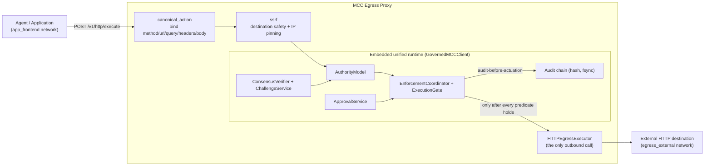
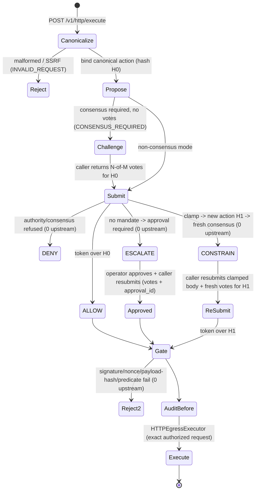

# Enforced Outbound HTTP Egress Proxy

> The proxy is an **enforcement and transport adapter**, not a governance engine.
> Every ALLOW / DENY / ESCALATE / CONSTRAIN decision comes from the existing
> MCC-Core runtime. No verified MCC authorization — no outbound HTTP execution.

The egress proxy makes MCC-Core the **enforced execution boundary** for outbound
HTTP. An application may use the supported `MCCGatewayClient` voluntarily; the
egress proxy is the network-level interception point so a request cannot leave
through an ungoverned path.

It adds no governance logic. It embeds the **same** unified runtime the gateway
uses (`AuthorityModel` → `DecisionEngine` → `ConsensusVerifier` /
`ChallengeService` → `EnforcementCoordinator` → `ExecutionGate` →
`ApprovalService` → nonce/idempotency/velocity/approval/challenge registries) via
the canonical in-process governed client `GovernedMCCClient`. The proxy only:

1. canonicalizes an outbound HTTP request into one bound action;
2. submits it through that runtime;
3. performs the real outbound call **only inside the governed executor callback**
   (`HTTPEgressExecutor`), after the gate verifies the signed token and the
   pre-actuation audit record is written;
4. fails closed against SSRF and destination confusion.

-----

## Architecture & trust boundary



The trust boundary: the application proposes an action and may carry consensus
votes or an approval id, but it can **never** assert a verdict — there is no
field by which a caller supplies ALLOW/DENY/ESCALATE/CONSTRAIN. Evaluator keys,
the signing key, and the approval issuer live in the runtime/deployment, never
in the caller.

-----

## Request lifecycle



### ALLOW
Token signed over the canonical action `H0`; the gate verifies it and consumes
the one-time nonce; consensus/challenge are re-verified at the coordinator; the
pre-actuation record is written; `HTTPEgressExecutor` performs the **exact**
request and returns a sanitized response.

### DENY
Authority (or consensus) refuses. No token reaches the executor; **zero upstream
calls**; a structured `DENY` (HTTP 403) is returned with the runtime's reason.

### ESCALATE
No mandate. The proxy opens an approval bound to the exact operation (state lives
in the runtime's `ApprovalService`, not the proxy) and returns the
`approval_request_id`. **Zero upstream calls.** An operator approves
(`POST /v1/approvals/{id}/approve`); the caller resubmits with the `approval_id`
(and, in consensus mode, the same votes). Only then does execution occur.

### CONSTRAIN → new hash → re-consensus
The authority clamps a governed field (e.g. `body.amount`). The **original action
is never executed.** The clamped action has a **different action hash** `H1`; the
proxy issues a **fresh challenge bound to `H1`** and returns the constrained
action. The caller obtains **fresh** N-of-M votes over `H1` and resubmits; the
token is signed over `H1`; only the constrained action executes.

```mermaid
sequenceDiagram
    actor App
    participant Proxy
    participant RT as Embedded runtime
    participant Up as Upstream
    App->>Proxy: POST {amount: 10000} (+ votes for H0)
    Proxy->>RT: submit(action H0, votes)
    RT-->>Proxy: CONSTRAIN -> clamped {amount: 5000} = H1 (not executed)
    Proxy->>RT: issue challenge bound to H1
    Proxy-->>App: CONSTRAIN + constrained_action + challenge(H1)
    App->>Proxy: POST {amount: 5000} constrained=true (+ fresh votes for H1)
    Proxy->>RT: execute_constrained(H1, votes)
    RT->>RT: re-verify consensus over H1; gate; audit-before-actuation
    RT->>Up: POST {amount: 5000}
    Note over Up: {amount: 10000} is never sent
```

-----

## Action canonicalization & hash binding

One deterministic, flat dict represents the action (`egress_proxy/canonical_action.py`),
hashed with the runtime's `hash_payload` (no parallel hashing format):

- envelope (top-level): `method`, `scheme`, `host`, `port`, `path`, sorted
  `query`, governed `headers`, `destination_id`, `action_type`;
- JSON body fields namespaced `body.<key>` plus `__body_keys__` (fixes the key
  set); non-JSON bodies bound by `__rawbody_sha256__`.

The decision token is signed over exactly this dict, so the gate's payload-hash
check binds authorization to the exact action. **Any** difference — host, method,
path, query, body, governed header, actor, transaction/idempotency id — changes
the hash and is denied. A CONSTRAIN clamp rewrites a `body.<key>` value, yielding
a new hash that re-canonicalizes identically to the resubmitted clamped request
(there is no stale body hash to diverge).

-----

## SSRF model

`egress_proxy/ssrf.py`, fail-closed by default at submission **and** at connect
time, with the executor pinning the connection to the validated IP (closing the
DNS-rebinding window):

- only `http`/`https`; embedded credentials rejected; malformed/ambiguous URLs
  rejected; hostnames normalized; ports validated;
- loopback, link-local, multicast, unspecified, reserved, and private addresses
  rejected **by default** (every resolved IP must pass — one bad IP rejects the
  host); IPv4-mapped IPv6 classified by the embedded v4;
- redirects disabled by default;
- restrictions configurable only through trusted deployment config
  (`allowed_hosts`, `allowed_ports`, and explicit `allow_loopback`/`allow_private`
  for dev/containers) — there is no implicit permissive default (an empty host
  allow-list denies all).

-----

## Header & credential model

- hop-by-hop headers (`connection`, `keep-alive`, `te`, `trailer`,
  `transfer-encoding`, `upgrade`) and `host`/`content-length` are stripped;
  proxy-auth headers from the caller are dropped; `Host` is set from the
  authorized destination, not caller input;
- only declared **governed** headers are part of the binding and forwarded;
  everything else is dropped (a caller cannot smuggle an ungoverned header past
  the authorization);
- sensitive response headers (`set-cookie`) are not relayed back;
- **credentials:** the proxy does not require raw long-lived destination secrets
  from callers. Destination credentials should be resolved by the proxy from
  trusted secret configuration / a credential reference. *Deferred in this PR:* a
  credential-injection resolver is not implemented; the safe default is that no
  caller-supplied authorization header is forwarded unless explicitly governed.
  Secrets are never logged, never placed in audit payloads, and never returned in
  errors.

-----

## Docker network model — what is and isn't enforced

`deploy/pilot/docker-compose.yml` separates three networks:

| Network | Members | Effect |
|---|---|---|
| `app_frontend` | reference agent, egress proxy | the agent can reach **only** the proxy |
| `egress_external` | egress proxy, gateway, upstream | only the proxy/gateway reach the upstream |
| `mcc_internal` (`internal: true`) | Redis, proxy, gateway | runtime state, no external route |

The reference agent is attached **only** to `app_frontend`, so it has **no route**
to the upstream or Redis — its sole path to the upstream is the governed proxy
(`reference-egress-agent` proves this: a direct call fails, the governed call
succeeds).

**Honest boundary statement.** Docker Compose networks demonstrate the boundary
for the reference deployment. They do **not** provide absolute host-level bypass
resistance: a workload with host networking, raw sockets, or its own egress route
is outside Compose's control. Production-grade isolation additionally requires
orchestrator/network policy — Kubernetes `NetworkPolicy` (default-deny egress), a
service mesh with mTLS + egress control, a firewalled/locked-down egress subnet,
or cloud VPC egress rules — with the proxy as the only permitted egress path.

-----

## Fail-closed behavior

Each of these yields no upstream call: malformed/SSRF-rejected action; authority
DENY; unresolved ESCALATE; CONSTRAIN before fresh authorization; gate rejection
(bad signature/nonce/payload-hash); below-threshold/forged/duplicate/expired/
vetoed consensus; replayed nonce or challenge; idempotency/velocity breach;
revoked mandate; audit-write failure; required-Redis unavailable; connect-time
SSRF rebinding rejection. Infrastructure failure is **never** converted into
ALLOW — it is surfaced as `DEPENDENCY_UNAVAILABLE` / `GOVERNANCE_UNAVAILABLE`
(503), `UPSTREAM_TIMEOUT` (504), or `UPSTREAM_ERROR` (502), distinct from a
governance `DENY` (403).

-----

## Readiness

`/health` is liveness. `/ready` returns 200 only when the runtime initialized, a
consensus verifier is present when consensus is required, and Redis is reachable
when any registry backend is `redis`; otherwise 503. The proxy is never "ready"
when it cannot enforce governed execution.

-----

## Deployment

```bash
# Generate keys/trust configs (public keys only; private keys git-ignored).
python deploy/pilot/generate_pilot_config.py
cp deploy/pilot/.env.example deploy/pilot/.env   # set the API keys

# Start the pilot (gateway + Redis + egress proxy + upstream + reference agent).
docker compose -f deploy/pilot/docker-compose.yml up --build
```

The `reference-egress-agent` container prints that direct egress is blocked and
governed egress works.

### Integration example (in-process, full consensus + re-consensus)

```bash
python examples/enforced_egress_agent.py
```

Drives ALLOW / DENY / ESCALATE→approval / CONSTRAIN→re-consensus / replay /
tamper / no-bypass against a live proxy, asserting the upstream receives only
authorized actions and never the original over-cap body.

-----

## Production hardening requirements

- Default-deny egress at the orchestrator/network layer with the proxy as the
  only egress path (Compose networks are a demonstration, not a guarantee).
- A persistent signing key (not the ephemeral dev key), and a real evaluator
  trust set with operationally **independent** evaluators.
- Redis with auth/TLS/HA; the audit chain on durable storage.
- A destination credential-injection resolver (deferred here).
- TLS destination pinning (the current IP-pinning is for `http`; `https` SNI/cert
  pinning needs additional work).
- Per-destination/per-actor rate and size limits tuned for the deployment.

-----

## Known limitations / deferred

- Credential injection for destination auth is an interface, not an
  implementation, in this PR.
- Redirects are disabled by default; re-governing each redirect hop is not
  implemented (a redirect is simply not followed).
- TLS (`https`) connection pinning to the validated IP is not done (only `http`);
  `https` relies on validation + the small remaining rebinding window.
- The nonce layer intentionally does not distinguish replay from nonce-store
  unavailability (to avoid leaking state); both fail closed, surfaced as `DENY`.
- Docker Compose isolation is a reference boundary, not host-level bypass
  resistance (see the network model above).

-----

## Explicit statements

- The proxy is an **enforcement adapter, not a governance engine**.
- **All decisions come from the existing MCC runtime** (`GovernedMCCClient`); the
  proxy decides nothing and has no parallel engine, second coordinator, or
  demo-only verifier.
- **Any modified action requires a new hash and fresh authorization** before
  execution; the original action is never mutated-and-forwarded.
- **Docker Compose demonstrates the boundary**; production enforcement also
  requires orchestrator/network policy.
- **Direct SDK usage remains useful**, but the egress proxy provides a stronger
  interception boundary at the network edge.
