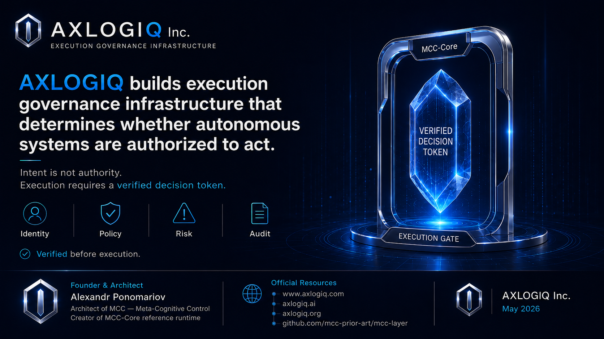

# MCC-I Exhibits G3–G4

## Verified Execution Authority

Public reference architecture for **AXLOGIQ Inc.** and **MCC-I — Infrastructure & Cloud Execution Governance**.

AXLOGIQ builds execution governance infrastructure that determines whether autonomous systems are authorized to act.

**Intent is not authority.**  
**Execution requires a verified decision token.**

---

## Exhibits

This folder contains public reference exhibits documenting the MCC-I execution governance architecture, including the Memory–Authority Boundary, stale-memory prevention, and verified execution authority model.

These materials support the public technical record of **AXLOGIQ Inc.**, **MCC-Core**, and **MCC-I**.

---

## Exhibit Index

### G3 — Memory–Authority Boundary

Documents the principle that memory, prior approval, or remembered context cannot become execution authority.

Core doctrine:

**Memory is not authority.**  
**Stale context cannot authorize current execution.**

### G4 — Stale Memory Prevention

Documents the practical failure mode where stale memory, outdated policy, or reused approval context could lead to unauthorized production execution.

Core doctrine:

**An agent may remember the past.**  
**MCC-I authorizes the present.**

### G4.1 — Technical Prevention Layer

Documents how MCC-I validates identity, policy version, context hash, risk level, approval state, token state, nonce/replay state, and audit path before execution.

Core doctrine:

**No verified decision token — no execution.**

---

## Architecture Principle

MCC-I does not treat model output, agent memory, or prior context as authorization.

Autonomous systems may propose actions, but execution requires verified authorization through MCC-Core.

The execution decision boundary evaluates:

- identity
- policy
- context
- risk
- approval state
- token state
- nonce / replay state
- auditability

The system returns one of four execution outcomes:

- **ALLOW**
- **DENY**
- **ESCALATE**
- **CONSTRAIN**

Execution is allowed only when a valid verified decision token is issued and accepted by the execution gate.

---

## Founder & Architect

**Alexandr Ponomariov**  
Founder & Architect, **AXLOGIQ Inc.**  
Architect of **MCC — Meta-Cognitive Control**  
Creator of **MCC-Core reference runtime**

---

## Official Resources

- Corporate: https://www.axlogiq.com
- Technical Product: https://axlogiq.ai
- Public Architecture Record: https://axlogiq.org
- GitHub Reference: https://github.com/mcc-prior-art/mcc-layer

---

## Status

Prepared: **May 2026**  
Classification: **Public Reference Architecture**  
Status: **Prototype / Technical Review**

---

## Claim Hygiene

These materials describe a public reference architecture and prototype implementation for technical review, simulation, enterprise PoC, and integration design.

They do not claim production certification, government approval, or certified safety status.

AXLOGIQ Inc. builds execution governance infrastructure for autonomous systems.

**Intent is not authority.**  
**Execution requires a verified decision token.**
