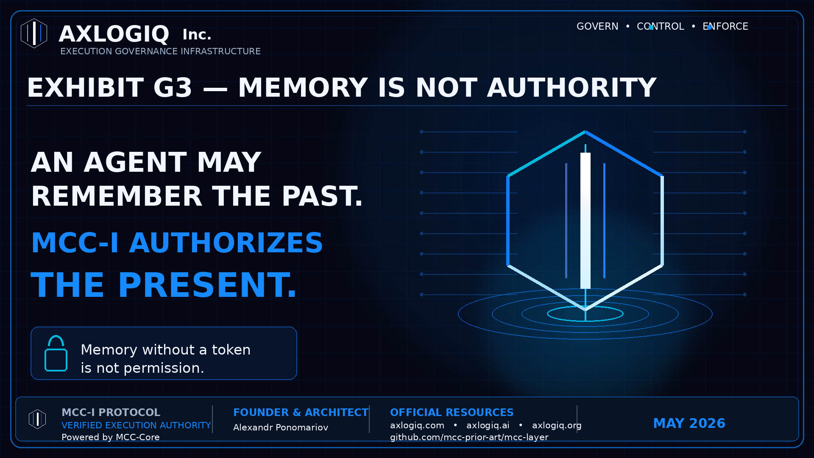
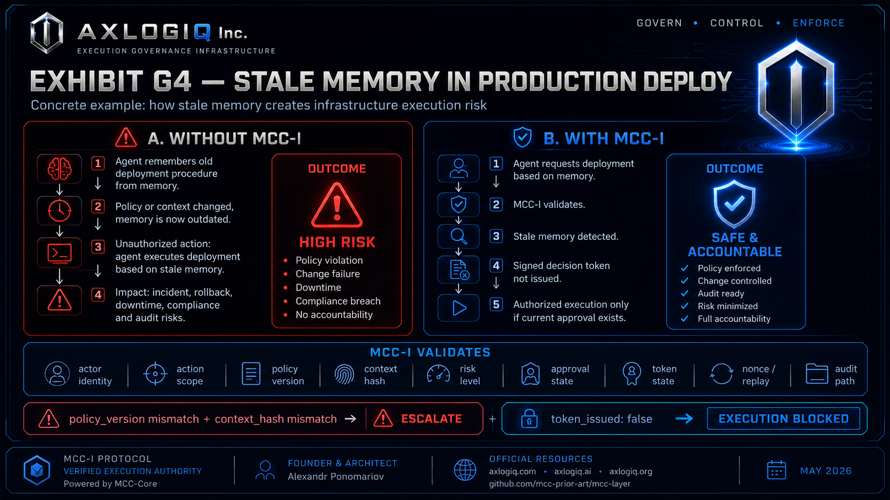
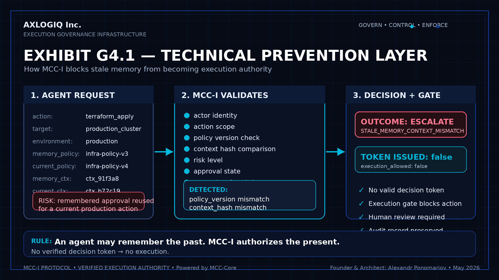

# MCC-I Exhibits G3–G4

## Verified Execution Authority

Public reference architecture for **AXLOGIQ Inc.** and **MCC-I — Infrastructure & Cloud Execution Governance**.

AXLOGIQ builds execution governance infrastructure that determines whether autonomous systems are authorized to act.

**Intent is not authority.**  
**Execution requires a verified decision token.**

---

## Exhibit Gallery

### Corporate Governance Exhibit

### G3 — Memory–Authority Boundary

### G4 — Stale Memory Production Deploy

### G4.1 — Technical Prevention Layer

---

## Exhibits

This folder contains public reference exhibits documenting the MCC-I execution governance architecture, including the Memory–Authority Boundary, stale-memory prevention, verified execution authority, and the technical prevention layer.

These materials support the public technical record of **AXLOGIQ Inc.**, **MCC-Core**, and **MCC-I**.

---

## Exhibit Index

### G3 — Memory–Authority Boundary

Documents the principle that memory, prior approval, or remembered context cannot become execution authority.

Core doctrine:

**Memory is not authority.**  
**Stale context cannot authorize current execution.**  
**Past approval does not authorize present execution.**

G3 establishes the Memory–Authority Boundary: an autonomous system may remember prior context, but memory alone cannot grant execution authority.

---

### G4 — Stale Memory Prevention

Documents the practical failure mode where stale memory, outdated policy, or reused approval context could lead to unauthorized production execution.

Example risk:

An autonomous infrastructure agent remembers a previous approval and attempts to reuse it for a current production action.

MCC-I prevents this by requiring current verification before execution.

Core doctrine:

**An agent may remember the past.**  
**MCC-I authorizes the present.**  
**No verified decision token — no execution.**

---

### G4.1 — Technical Prevention Layer

Documents how MCC-I validates identity, policy version, context hash, risk level, approval state, token state, nonce/replay state, and audit path before execution.

G4.1 demonstrates how stale memory is blocked from becoming execution authority.

Validation checks include:

- actor identity
- action scope
- policy version
- context hash
- risk level
- approval state
- token state
- nonce / replay state
- audit path

If MCC-I detects stale memory, policy mismatch, context mismatch, missing approval, invalid token state, or replay risk, the execution gate blocks or escalates the action.

Core doctrine:

**No verified decision token — no execution.**

---

## Architecture Principle

MCC-I does not treat model output, agent memory, or prior context as authorization.

Autonomous systems may propose actions, but execution requires verified authorization through MCC-Core.

The execution decision boundary evaluates:

- identity
- policy
- context
- risk
- approval state
- token state
- nonce / replay state
- auditability

The system returns one of four execution outcomes:

- **ALLOW**
- **DENY**
- **ESCALATE**
- **CONSTRAIN**

Execution is allowed only when a valid verified decision token is issued and accepted by the execution gate.

---

## MCC-Core Execution Flow

Intent → MCC-Core Evaluation → Verified Decision Token → Execution Gate → Authorized Execution → Audit

The model proposes.  
MCC-Core evaluates.  
The gate enforces.  
The audit trail records.

---

## Core Invariants

**No identity — no execution.**  
**No policy — no execution.**  
**No verified decision token — no execution.**  
**No audit — no trust.**  
**Used nonce — deny.**  
**Expired token — deny.**  
**Fail-closed by default.**

---

## Why This Matters

MCC-I addresses a specific execution-governance failure mode:

Autonomous systems may retain, reuse, or infer authority from stale memory, outdated context, or previous approvals.

In infrastructure and cloud environments, that failure mode can lead to unauthorized production changes, deployment actions, policy changes, or operational risk.

MCC-I introduces a verified execution boundary before action.

Memory may inform a proposal.  
Memory cannot authorize execution.

---

## Category Positioning

AXLOGIQ Inc. builds execution governance infrastructure for autonomous systems.

MCC-Core is not a generic AI safety layer.

MCC-Core is a verified execution authority layer.

It governs whether autonomous systems are authorized to act before execution occurs.

**Intent is not authority.**  
**Execution requires a verified decision token.**

---

## Founder & Architect

**Alexandr Ponomariov**  
Founder & Architect, **AXLOGIQ Inc.**  
Architect of **MCC — Meta-Cognitive Control**  
Creator of **MCC-Core reference runtime**

---

## Official Resources

- Corporate: https://www.axlogiq.com
- Technical Product: https://axlogiq.ai
- Public Architecture Record: https://axlogiq.org
- GitHub Reference: https://github.com/mcc-prior-art/mcc-layer

---

## Status

Prepared: **May 2026**  
Classification: **Public Reference Architecture**  
Status: **Prototype / Technical Review**

---

## Claim Hygiene

These materials describe a public reference architecture and prototype implementation for technical review, simulation, enterprise PoC, integration design, and public technical record purposes.

They do not claim production certification, government approval, certified safety status, or regulated compliance approval.

AXLOGIQ Inc. builds execution governance infrastructure for autonomous systems.

**Intent is not authority.**  
**Execution requires a verified decision token.**
