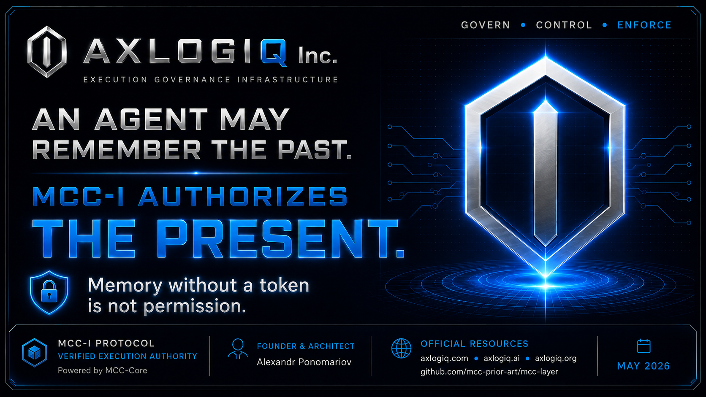
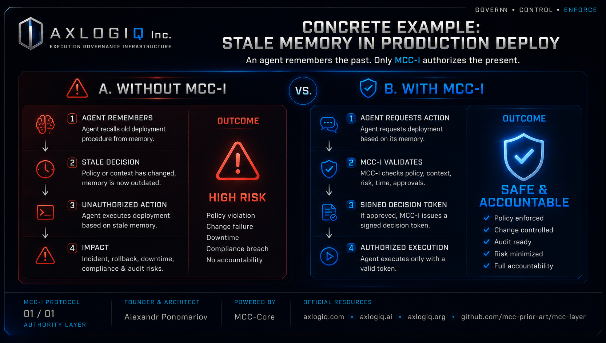

# MCC-I Exhibits G3–G4

**Verified Execution Authority**  
Public reference architecture for AXLOGIQ Inc.

---

## Exhibit G3 — Memory Is Not Authority

> **Core principle**  
> An agent may remember the past. MCC-I authorizes the present.

> **Supporting doctrine**  
> Memory without a token is not permission.

**Purpose**  
Exhibit G3 establishes the memory-authority boundary. While agent memory, historical context, prior approvals, and remembered workflows may inform decisions, they do **not** grant execution authority.

---

## Exhibit G4 — Stale Memory in Production Deploy

> **Purpose**  
> Exhibit G4 demonstrates the operational risk of stale memory in a concrete infrastructure scenario.

**Without MCC-I**  
An agent may reuse outdated deployment memory and proceed with a high-risk production action.

**With MCC-I**  
Execution requires current verification and a valid decision token before proceeding.

---

## Relationship to MCC-Core

| Component   | Role                                              |
|-------------|---------------------------------------------------|
| **MCC-I**       | Infrastructure & Cloud Execution Governance vertical |
| **MCC-Core**    | The technical decision engine powering verified execution authority |

In this exhibit series:
- **G3** = Core principle
- **G4** = Operational validation

**Key takeaway:** Remembered context is not execution authority. Infrastructure changes require a **current verified decision**.

---

## Claim Hygiene

These exhibits are **public reference architecture and technical review materials**.

They should **not** be described as:
- Certified production safety materials
- Government-approved materials
- Third-party-endorsed materials
- Production-certified
