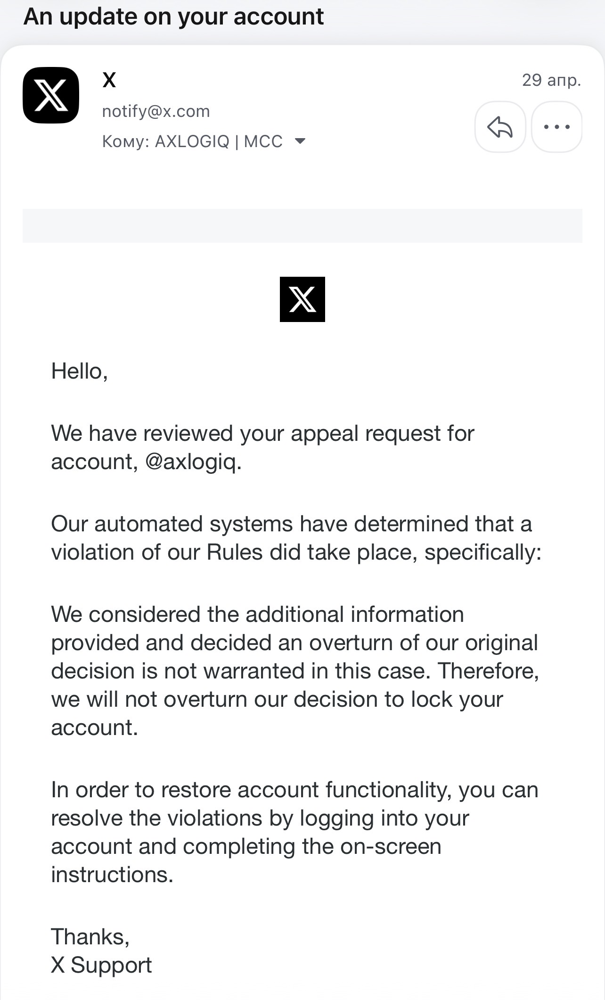

# Exhibit: X Platform Ban Event — April 2026

**Record type:** Documented platform-governance failure / evidence exhibit  
**Project:** MCC / MCC-Core  
**Author:** Alexandr Ponomariov / AXLOGIQ Inc.  
**Account:** `@axlogiq_ai`  
**Event date:** 23.04.2026  
**Appeal response date:** 29.04.2026  
**Filed:** June 2026

---

## Summary

The account `@axlogiq_ai`, which was used to publish MCC / MCC-Core materials on execution governance for autonomous AI systems, was permanently suspended by X platform systems in April 2026.

The suspension occurred shortly after a public Grok / xAI response engaged with the MCC execution-governance concept.

The X appeal response stated that X's automated systems determined that a rule violation had occurred and that the original decision would not be overturned.

This exhibit is preserved as a documented platform-governance case relevant to MCC-Core's core thesis: high-impact automated decisions require transparent authority, escalation paths, auditability, and reviewable decision records.

---

## Timeline

| Date | Event |
|---|---|
| 20.04.2026 | First MCC prior-art materials publicly disclosed through `@axlogiq_ai`. |
| 21.04.2026 | MCC v0.5 + GPT-4.1 feature expansion posted and archived. |
| 21.04.2026 | Grok / xAI publicly responded to the MCC execution-governance concept. |
| 23.04.2026 | `@axlogiq_ai` was permanently suspended by X platform systems. |
| 29.04.2026 | X Support appeal response stated that automated systems determined a violation had occurred and that the decision would not be overturned. |

**Interval between Grok / xAI public response and suspension:** approximately 2 days.

---

## Primary Evidence

### Grok / xAI Public Response — April 2026

Grok / xAI publicly responded to the MCC execution-governance concept.

Verbatim excerpt preserved in repository screenshot:

> "Layers like your MCC (policy + audit + rollback) are how the ecosystem adds the brakes. Solid approach."

Evidence: [`../../proof/screenshot.png`](../../proof/screenshot.png)

---

### X Support Appeal Response — 29.04.2026

Verbatim excerpt from X Support response:

> "Our automated systems have determined that a violation of our Rules did take place."

Additional excerpt:

> "We considered the additional information provided and decided an overturn of our original decision is not warranted in this case."

Evidence image: `X_Appeal_Response_2026-04-29.png`

---

## Governance Failure Analysis

The X platform incident is relevant to MCC-Core because it illustrates the risk of high-impact automated decisions where the affected party receives limited decision transparency, limited rationale, and limited evidence of escalation or reviewability.

| MCC-Core Governance Requirement | Observed Platform Behavior |
|---|---|
| Decision rationale should be explicit and reviewable | The response cites automated systems but does not provide a specific rule-mapping rationale. |
| High-impact DENY outcomes should support escalation | The account-level consequence was permanent suspension. |
| Appeals should produce reviewable decision records | The appeal response did not provide a detailed audit trail or policy-specific explanation. |
| Post-factum review is weaker than pre-execution governance | The account was actioned first; the appeal occurred after the consequence. |
| Policy transparency should exist at the decision point | The response did not identify a specific rule subsection or evidence item. |

---

## Relevance to MCC-Core

MCC-Core defines a verified execution boundary before action.

The X platform suspension event is included as a real-world case study showing why automated systems that produce high-impact outcomes need:

- explicit policy mapping
- accountable decision records
- escalation paths
- reviewable audit chains
- separation between automated proposal and authorized execution
- non-post-factum governance for irreversible or high-impact outcomes

This case does not prove causation between the Grok / xAI response and the suspension.

It documents temporal proximity and a platform response that attributed the decision to automated systems.

---

## Reframe

The account used to publish MCC-Core materials was actioned by an automated platform decision process.

The appeal response did not provide a detailed audit trail, rule-specific rationale, or transparent escalation record.

That is precisely the class of governance gap MCC-Core is designed to address.

> The model may propose.  
> Authority must be verified.  
> The gate must enforce.  
> The audit chain must record.

---

## Claim Hygiene

This record is presented as a public evidence exhibit and platform-governance case study.

It does not claim:

- legal wrongdoing by X Corp.
- formal causation between the Grok / xAI response and the suspension
- patent status
- formal legal priority determination
- production deployment
- third-party endorsement
- certification
- customer validation
- government approval

The X platform suspension is documented as an illustrative governance failure relevant to execution-governance architecture.
