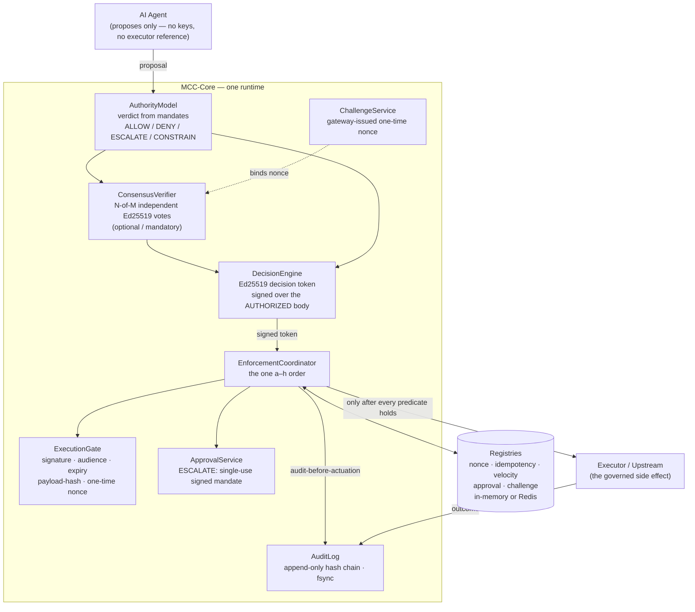
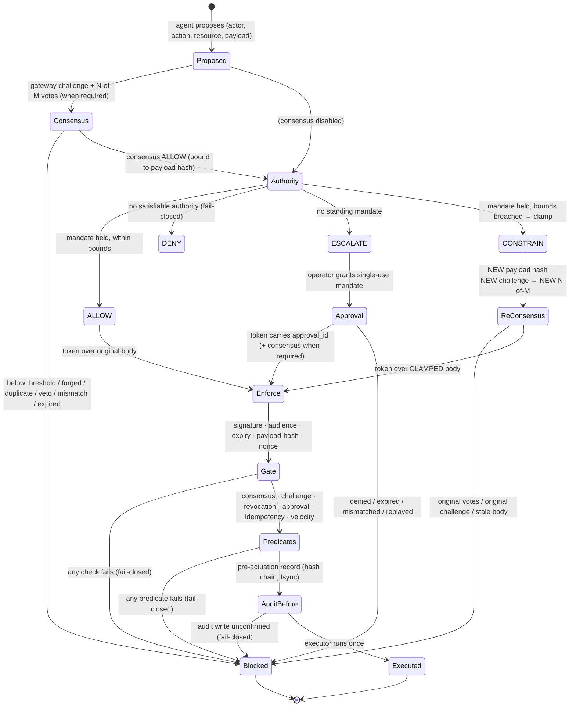
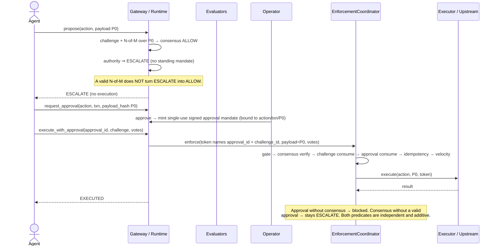

# Unified Governance Runtime

> The model proposes. MCC-Core decides. The gate enforces. The audit chain records.

This document describes the **one** MCC-Core governance runtime that every entry
point shares — the in-process governed client, the HTTP gateway, and the egress
proxy all drive the **same** decision/enforcement path. There is:

- **one runtime** — `AuthorityModel` → `DecisionEngine` (Ed25519 token) →
  `EnforcementCoordinator` → `ExecutionGate` → executor → `AuditLog`;
- **no parallel governance engine** — every surface composes the same
  `mcc_core` components;
- **no demo-only verifier** — consensus is the real `ConsensusVerifier`; the
  challenge is the real `ChallengeService`; the gate is the real `ExecutionGate`;
- **no second coordinator** — exactly one `EnforcementCoordinator.enforce`
  sequences every governed execution;
- **no executor bypass** — the only route to a side effect is
  `coordinator.enforce(executor=…)` after the gate verifies a signed decision
  token and the pre-actuation audit record is written.

The reference implementations live in:

| Surface | Module | Form |
|---|---|---|
| In-process governed client | `examples/governed_agent/mcc_client.py` (`GovernedMCCClient`) | embed the runtime in a process |
| HTTP gateway | `gateway/app.py` + `gateway/governance_service.py` | the runtime as a network service |
| Egress proxy (owns the outbound socket) | `interceptors/egress_proxy.py` | DENY means the connection never opens |
| Supported Python SDK (HTTP) | `pilot/client.py` (`MCCGatewayClient`) | typed client for the deployed gateway |
| Reference integration (outbound HTTP) | `examples/pilot_reference_integration.py` | agent → MCC → real upstream |

-----

## High-level architecture



Default behavior is **fail-closed**: if MCC-Core does not issue a signed ALLOW
(or CONSTRAIN) token and every predicate the coordinator requires does not hold,
the gate does not open and the executor is never called.

-----

## Decision state machine



-----

## Sequence: consensus → ALLOW → execution

```mermaid
sequenceDiagram
    actor Agent
    participant GW as Gateway / Runtime
    participant Pool as Evaluators (independent keys)
    participant CV as ConsensusVerifier
    participant Coord as EnforcementCoordinator
    participant Gate as ExecutionGate
    participant Exec as Executor / Upstream
    participant Audit as Audit chain

    Agent->>GW: propose(action, payload)
    GW->>GW: issue_challenge → one-time nonce bound to payload_hash(P0)
    GW-->>Pool: challenge (action/actor/resource/payload_hash/policy_hash)
    Pool-->>GW: N signed votes bound to the challenge nonce + P0
    GW->>CV: verify(votes, payload=P0, nonce)
    CV-->>GW: ALLOW (threshold met, no veto)
    GW->>GW: authority ALLOW → issue Ed25519 token over P0 (carries nonce, challenge_id)
    GW->>Coord: enforce(token, payload=P0, votes)
    Coord->>Gate: verify signature/audience/expiry/payload-hash; consume nonce
    Coord->>CV: re-verify N-of-M bound to the gate-verified token
    Coord->>Coord: consume challenge (single-use); idempotency; velocity
    Coord->>Audit: pre-actuation record (hash chain, fsync)
    Coord->>Exec: execute(action, P0, token)
    Exec-->>Coord: result
    Coord->>Audit: actuation result
    GW-->>Agent: EXECUTED (audit ref)
```

## Sequence: consensus → ESCALATE → approval → execution



## Sequence: consensus → CONSTRAIN → new payload hash → re-consensus → execution

```mermaid
sequenceDiagram
    actor Agent
    participant GW as Gateway / Runtime
    participant Pool as Evaluators
    participant CV as ConsensusVerifier
    participant Coord as EnforcementCoordinator
    participant Exec as Executor / Upstream

    Agent->>GW: propose(action, payload P0 = {amount: 10000})
    GW->>GW: challenge#1 + N-of-M#1 over P0 → consensus ALLOW(P0)
    GW->>GW: authority ⇒ CONSTRAIN → clamp to P1 = {amount: 5000}
    Note over GW: payload_hash(P1) ≠ payload_hash(P0). Consensus#1 authorized P0,<br/>NOT P1. The runtime returns RECONSENSUS_REQUIRED and executes nothing.
    GW-->>Agent: CONSTRAIN(P1), not executed
    Agent->>GW: issue_challenge(payload = P1)
    GW->>GW: challenge#2 bound to payload_hash(P1)
    GW-->>Pool: challenge#2
    Pool-->>GW: N signed votes bound to challenge#2 nonce + P1
    Agent->>GW: execute_constrained(P1, challenge#2, votes#2)
    GW->>GW: re-evaluate authority on P1 ⇒ clean ALLOW (no further rewrite)
    GW->>GW: issue token over P1 (carries challenge#2 nonce + challenge_id)
    GW->>Coord: enforce(token, payload=P1, votes#2)
    Coord->>CV: verify N-of-M bound to P1 (votes#1 over P0 would mismatch → blocked)
    Coord->>Coord: challenge#2 consume; idempotency; velocity; audit-before-actuation
    Coord->>Exec: execute(action, P1, token)
    Exec-->>Coord: result
    GW-->>Agent: EXECUTED with P1 = {amount: 5000}; P0 = {amount: 10000} never executed
```

-----

## Path comparison

| | ALLOW | DENY | ESCALATE | CONSTRAIN |
|---|---|---|---|---|
| **Authority condition** | mandate held, within bounds | no satisfiable authority (`requires=None`, or `default`) | no standing mandate for the required authority | mandate held, a bound is breached |
| **Payload executed** | original `P0` | none | none until approved (then `P0`) | clamped `P1` (≠ `P0`) |
| **Decision token issued** | yes, over `P0` | no | no (until approval mints a single-use mandate) | yes, over `P1` |
| **Extra predicate before execution** | consensus + challenge (when required) | — (blocked) | single-use approval **and** consensus/challenge (when required) | **fresh** challenge + **fresh** N-of-M over `P1` |
| **Re-consensus required?** | no | n/a | no (same `P0`) | **yes** — new payload hash ⇒ new verified consensus |
| **Executor reached?** | yes, once, via coordinator | never | only after approval (+ consensus) via coordinator | yes, once, via coordinator, with `P1` |
| **Audit** | evaluate + pre-actuation + result | evaluate / rejection | evaluate + approval lifecycle + (on execute) pre-actuation + result | evaluate(CONSTRAIN) + re-consensus + pre-actuation + result |

`P0` = proposed payload; `P1` = authority-clamped payload.

-----

## Core invariant: a modified payload requires new consensus

> **Any modification to the payload produces a new payload hash, and a new
> payload hash requires a new, independently verified consensus (and a new
> single-use challenge) before execution. Consensus is never transferable from
> one payload to another.**

Why this holds in the runtime, not by convention:

1. The decision token is signed **over the body that will actually be
   forwarded** (`forward_context`) — `P0` for ALLOW, the clamped `P1` for
   CONSTRAIN. The `ExecutionGate` recomputes `payload_hash` and rejects any token
   whose body does not match.
2. Each evaluator vote and each gateway challenge is **bound to a specific
   `payload_hash`**. The `ConsensusVerifier` compares the votes' payload to the
   token's payload; the coordinator's challenge consume compares the challenge's
   `payload_hash` to the token's. A vote or challenge issued for `P0` cannot
   satisfy a token over `P1` — both checks mismatch and fail closed.
3. Therefore, when authority returns CONSTRAIN, the runtime **does not** execute
   the clamped body on the strength of the original consensus. It surfaces the
   clamped body as `RECONSENSUS_REQUIRED` and executes nothing. A fresh challenge
   bound to `payload_hash(P1)` and fresh N-of-M votes over `P1` are the only way
   to authorize the clamped execution.
4. The one-time nonce (gateway-issued challenge) makes each consensus package
   **single-use**: it cannot be replayed against a second payload or a second
   execution.

This invariant is exercised end to end in
`tests/examples/test_governed_agent_combined.py` (re-consensus, original-votes
rejection, tampered-body rejection) and in the reference integration
(`examples/pilot_reference_integration.py`): the original `{amount: 10000}` is
never sent upstream; only the re-consensused `{amount: 5000}` is.

-----

## One runtime — explicit confirmation

- **One runtime.** Authority, token signing, consensus, challenge, gate,
  approval, coordinator, and audit are the single set of `mcc_core` components.
  The gateway, the egress proxy, the in-process client, and the reference
  integration are *adapters* around that one runtime, not reimplementations.
- **No parallel governance engine.** No surface re-derives a verdict, re-signs a
  token, or re-checks consensus with its own logic; they call the same objects.
- **No demo-only verifier.** Tests and demos use the production
  `ConsensusVerifier`, `ChallengeService`, `ExecutionGate`, `ApprovalService`,
  and `EnforcementCoordinator`. The only test-specific object is the *executor*
  (the thing being governed) and an in-memory FakeRedis used to model two
  instances of a real Redis.
- **No second coordinator.** Every governed execution flows through exactly one
  `EnforcementCoordinator.enforce`. There is no alternate path that reaches an
  executor.
- **No executor bypass.** The executor refuses any call that does not carry the
  verified decision token MCC issued for that exact operation
  (`UnauthorizedExecution`), and the coordinator is the only caller. An agent
  holds no signing key, no credentials, and no executor reference.

See also: `docs/MULTI_CONTEXT_CONSENSUS.md`, `docs/CONSENSUS_CHALLENGE.md`,
`docs/ESCALATE_APPROVAL.md`, `docs/TRANSACTION_GOVERNANCE.md`,
`docs/GOVERNANCE_HTTP_API.md`, and the pilot deployment in `deploy/pilot/`.
