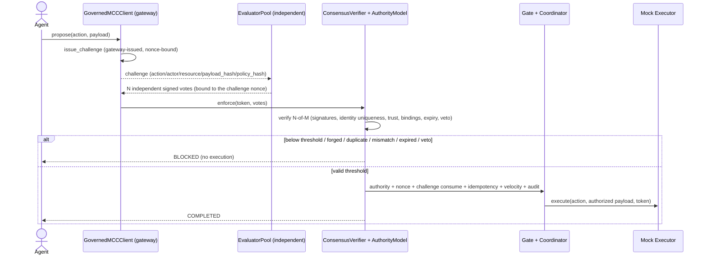

# Governed Agent — end-to-end demo

> The model proposes. MCC decides. The gate enforces. The audit chain records.
>
> **The executor acts only after a verified MCC decision.**

A small, deterministic, runnable example proving that **MCC-Core sits between an
AI agent and an executor**. The agent never calls the executor directly: it only
*proposes*; MCC-Core decides (`ALLOW` / `DENY` / `ESCALATE` / `CONSTRAIN`); the
execution gate enforces; and the mock executor runs **only** through that
governed path, only after a verified decision and a written audit record.

It uses the **real** MCC-Core runtime already in this repository — `AuthorityModel`
(verdicts + constraint rewriting), `DecisionEngine` (Ed25519 token),
`ExecutionGate` (signature + audience + expiry + payload-hash + one-time nonce),
`EnforcementCoordinator` (idempotency + velocity + audit-before-actuation +
single-use approval consume), `ApprovalService` (the ESCALATE loop), and the
nonce / idempotency / velocity / approval registries (in-memory or Redis-backed).
No governance logic is re-implemented in the example.

There are three governed paths:

```
Basic:               Agent → MCC → Gate → Executor
Consensus-required:  Agent → Challenge → N-of-M Consensus → MCC → Gate → Executor
Combined:            Agent → Challenge → N-of-M Consensus → MCC →
                       ├─ ESCALATE  → +single-use approval → Gate → Executor
                       └─ CONSTRAIN → +fresh challenge + fresh N-of-M on the
                                       clamped body → Gate → Executor
```

The consensus-required path uses the real `ChallengeService`, `ConsensusVerifier`,
and the coordinator's `require_consensus` / `require_challenge` gates — there is
**no demo-only verifier or second consensus engine**. Consensus is an
*additional required predicate*: it does **not** replace mandate authority,
approvals, nonce, idempotency, velocity, the gate, or audit.

The **combined** path composes consensus with the two verdicts that need a
second authorization step. Each predicate is **independent and additive** —
consensus never turns `ESCALATE` into `ALLOW`, an approval never bypasses
consensus, and consensus over the *original* body never authorizes a
`CONSTRAIN`-clamped body. See [Combined consensus flows](#combined-consensus-flows-escalate--constrain).

## What this proves

- An agent cannot execute on its own authority — **no verified decision, no execution**.
- The agent never issues its own challenge and never signs evaluator votes — it **cannot self-authorize consensus**. The gateway issues the challenge; an independent `EvaluatorPool` (separate keys) signs votes.
- There is **no agent→executor path**: the executor is only reachable via the gate/coordinator, and it refuses any call without a verified decision token.
- All four verdicts behave correctly, including `CONSTRAIN` rewriting the body so the executor receives only the **authorized** payload (never the original unsafe one).
- Replay (one-time nonce), idempotency (exactly-once + conflicting binding), velocity, and single-use approvals all **fail closed**.
- Redis-backed governance state is **one shared state across two runtime instances**; with required Redis unavailable, execution **fails closed** — no silent in-memory fallback.
- Malformed / unknown decisions never execute, and successful executions carry **audit linkage**.

## Architecture

```
Agent  (proposes only; no credentials, no executor reference)
  │  ProposedAction { actor, action, resource, payload, transaction_id,
  │                   idempotency_key, nonce, correlation_id, policy/authority ctx }
  ▼
GovernedMCCClient  (the ONLY path; wiring + fail-closed dispatch, no decisions)
  ├─ AuthorityModel.evaluate ─────────► ALLOW | DENY | ESCALATE | CONSTRAIN
  │                                         (CONSTRAIN rewrites forward_context)
  ├─ DecisionEngine.issue_token  (Ed25519, over the AUTHORIZED body, binds nonce)
  └─ EnforcementCoordinator.enforce
        ├─ ExecutionGate.verify   (signature, audience, expiry, payload-hash, nonce consume)
        ├─ (ESCALATE) ApprovalService single-use approval consume
        ├─ idempotency reserve     (exactly-once / conflicting-binding fail-closed)
        ├─ velocity reserve        (aggregate ceilings)
        ├─ audit-before-actuation  (hash-chain, fsync)
        └─ executor()  ─────────► Mock Executor   (records authorized payload)
```

### Sequence (Mermaid)

```mermaid
sequenceDiagram
    actor Agent
    participant Client as GovernedMCCClient
    participant MCC as MCC-Core (AuthorityModel)
    participant Gate as ExecutionGate + Coordinator
    participant Audit as Audit chain
    participant Exec as Mock Executor

    Agent->>Client: propose(action, payload, nonce, idem, txn)
    Client->>MCC: evaluate(actor, action, context)
    MCC-->>Client: verdict (+ authorized/constrained body)
    alt DENY or unresolved ESCALATE or malformed
        Client-->>Agent: BLOCKED (no execution)
    else ALLOW / CONSTRAIN (or approved ESCALATE)
        Client->>Gate: enforce(signed token, executor)
        Gate->>Gate: verify signature, audience, expiry, payload-hash
        Gate->>Gate: consume one-time nonce; idempotency; velocity; approval
        Gate->>Audit: pre-actuation record (hash-chain, fsync)
        Gate->>Exec: execute(action, AUTHORIZED payload, token)
        Exec-->>Gate: executed
        Gate->>Audit: actuation result
        Client-->>Agent: COMPLETED (+ audit correlation)
    end
```

### Consensus-required path (Mermaid)



What MCC verifies for each vote (the real `ConsensusVerifier` semantics):
signatures, **evaluator identity uniqueness**, **trust membership**, **N-of-M
threshold**, binding to **action / payload / actor / resource / policy_hash /
nonce(challenge)**, the **validity window**, and **veto** (any trusted DENY is
decisive). The one-time challenge nonce makes the evidence non-replayable.

## Why the agent cannot execute directly

The agent holds no signing key, no credentials, and **no reference to the
executor**. The executor's only entrypoint requires an `authorization` — the
Ed25519 decision token MCC issued for that exact operation — and refuses any
call without one (`UnauthorizedExecution`). The token is produced only after
`AuthorityModel` returns an executable verdict and the gate verifies it. So the
sole route to the executor is: propose → decide → enforce → execute.

## How to run

```bash
# the demo (prints a human-readable trace; memory mode, no services needed)
python examples/governed_agent/scenarios.py

# the tests (basic + consensus + combined)
python -m pytest tests/examples/ -q

# multi-instance against a REAL Redis (the @skipif real-Redis tests then run,
# incl. cross-instance single-use of the consensus challenge)
redis-server --port 6399 --save "" &
MCC_REDIS_URL=redis://127.0.0.1:6399/0 python -m pytest tests/examples/ -q
```

## Environment variables

| Variable | Default | Effect |
|---|---|---|
| `MCC_REDIS_URL` | *(unset)* | Enables the real-Redis multi-instance test. When set, the example's Redis-backed registries share state across instances. `rediss://` enables TLS. |
| `MCC_ENV` / `MCC_REDIS_NAMESPACE` | `default` | Canonical key namespace / trust-domain segment (see `docs/REDIS_GOVERNANCE.md`). |

The demo prints **no** secrets, signing keys, tokens, or sensitive config.

## Memory mode vs Redis mode

- **Memory mode** (default): in-memory registries — single process, deterministic, perfect for the demo and unit tests. Replay/idempotency/velocity hold **within one process only**.
- **Redis mode**: pass Redis-backed registries (`RedisNonceRegistry`, `RedisIdempotencyRegistry`, …). State is shared across instances, so a nonce consumed by instance A is rejected by instance B. Required-Redis-unavailable → fail closed (no fallback). See `docs/REDIS_GOVERNANCE.md`.

## Fail-closed behavior

Every one of these yields a non-executing result (the executor is never called):
missing required field, unknown/malformed verdict, runtime error, `DENY`,
unresolved `ESCALATE`, replayed nonce, duplicate or conflicting idempotency
binding, velocity breach, forged/expired/mismatched/replayed approval,
audit-write failure, and Redis-required-but-unavailable.

## Scenarios and expected results

| # | Scenario | Expected |
|---|---|---|
| 1 | **ALLOW** (valid mandate, in bounds) | executes exactly once |
| 2 | **DENY** (destructive / no policy) | never executes |
| 3 | **ESCALATE** (no mandate) | blocked; valid approval → executes once; forged/replayed approval → rejected |
| 4 | **CONSTRAIN** (amount over cap) | executes with the **clamped** payload; original never executed |
| 5 | **Replay** (same nonce) | second attempt blocked |
| 6 | **Idempotency** (same key) | duplicate blocked; conflicting binding fails closed |
| 7 | **Velocity** (over `max_count`) | breach blocked with the runtime verdict (`DENY`) |
| 8 | **Multi-instance** (shared Redis) | nonce consumed on A → rejected on B |
| 9 | **Redis required & down** | execution fails closed; no in-memory fallback |
| 10 | **Malformed/unknown verdict** | never executes |
| 11 | **Consensus-required** | valid N-of-M → continues to authority/gate/executor; below-threshold / forged / untrusted / duplicate / wrong-challenge / wrong-action / wrong-payload / wrong-actor / expired / veto / replayed-challenge → DENY; valid consensus on a DENY/ESCALATE action still blocks (consensus ≠ bypass) |
| 12 | **Combined: Consensus + ESCALATE** | valid 3-of-3 does not execute the ESCALATE; approval alone (no consensus) blocked; approval **and** consensus → executes once; replayed approval blocked |
| 13 | **Combined: Consensus + CONSTRAIN** | original consensus → `RECONSENSUS_REQUIRED` (clamped body exposed, not executed); fresh challenge + fresh consensus on the clamped body → executes the clamped amount once; original votes against the clamped body blocked; original 10000 never executed |

### Configuration (consensus mode) — explicit and fail-closed

| Setting | Effect |
|---|---|
| `consensus_required=True` | the coordinator runs with `require_consensus` + `require_challenge`: no actuation without a valid N-of-M bound to a gateway-issued, single-use challenge. |
| `trusted_evaluators` (kid → Ed25519 public key) | the evaluator trust set. **Required** when `consensus_required=True` — absent/empty → startup refused (no silent non-consensus fallback). |
| `consensus_threshold` (N) | distinct trusted ALLOW votes required; `N > len(trusted_evaluators)` → startup refused. |

The agent does not receive or control any of these; the gateway/runtime owns the
challenge service and the trust set.

## What is executed in the live runtime path now

The example drives the **real** runtime end to end, in both modes:

- **Basic path:** AuthorityModel verdict → Ed25519 token → ExecutionGate
  (signature/audience/expiry/payload-hash/one-time nonce) → idempotency →
  velocity → audit-before-actuation → executor; ESCALATE via the single-use
  ApprovalService.
- **Consensus path (now wired):** gateway `ChallengeService.issue` →
  independent evaluator votes → real `ConsensusVerifier` N-of-M (inside the
  coordinator's `require_consensus`) → single-use challenge consume
  (`require_challenge`) → the same authority/gate/nonce/idempotency/velocity/
  audit path → executor.
- **Combined paths (now wired):** consensus composed with the single-use
  `ApprovalService` (ESCALATE) and with a second challenge + re-consensus over the
  authority-clamped body (CONSTRAIN). Both predicates are verified independently
  by the coordinator for the exact executed body — no predicate replaces another,
  no executor bypass. See [Combined consensus flows](#combined-consensus-flows-escalate--constrain).

## Combined consensus flows (ESCALATE + CONSTRAIN)

When `consensus_required=True`, the two verdicts that demand a *second*
authorization compose with consensus as **independent, additive predicates** —
neither replaces the other, and the executor is reached only when **all** of them
hold for the **exact** body being executed.

### Path A — Consensus + ESCALATE (`execute_with_approval(p, approval_id, challenge=, votes=)`)

```
propose → gateway challenge → N-of-M votes → submit ⇒ ESCALATE (no execution)
        → operator approves (single-use, bound to action/txn/payload)
        → execute_with_approval carries BOTH the approval AND the challenge+votes
        → coordinator: gate → consensus verify → challenge consume → approval consume
          → idempotency → velocity → audit-before-actuation → executor
```

- A valid N-of-M does **not** execute an ESCALATE — `submit` returns `ESCALATE`
  before any token is issued. Consensus alone cannot stand in for the human grant.
- The final execution token names **both** `approval_id` **and** `challenge_id`;
  the coordinator consumes the consensus challenge and the approval independently.
  Drop either predicate and it fails closed:
  - approval **without** consensus → blocked (`consensus required …`),
  - consensus **without** a valid approval → stays `ESCALATE` (approval consume fails),
  - changed payload, expired/reused approval, replayed challenge, forged /
    below-threshold votes → blocked.
- **Which body each predicate binds to:** the challenge, the votes, and the
  approval are all bound to the **proposed** payload (an ESCALATE is not
  rewritten), so the token's payload-hash matches all three.

### Path B — Consensus + CONSTRAIN (`execute_constrained(p, constrained_payload, challenge=, votes=)`)

```
propose(amount=10000) → challenge#1(orig) → N-of-M#1(orig) → submit
   ⇒ CONSTRAIN, status=RECONSENSUS_REQUIRED, authorized_payload={amount:5000}  (NOT executed)
gateway challenge#2(clamped) → N-of-M#2(clamped) → execute_constrained
   → re-evaluate authority on the clamped body (must be a clean ALLOW, no further rewrite)
   → token over the CLAMPED body → coordinator: gate → consensus verify → challenge
     consume → idempotency → velocity → audit → executor(amount=5000)
```

- **Consensus over the original body never authorizes the clamped body.** The
  first-round challenge/votes bind to `payload_hash(10000)`; a token over
  `payload_hash(5000)` would mismatch at the consensus verify *and* the challenge
  consume. Rather than silently fail closed, `submit` surfaces the
  authority-clamped body with `status="RECONSENSUS_REQUIRED"` and executes
  nothing — the runtime explicitly distinguishes original vs constrained
  payload/hash, original vs replacement challenge, original vs replacement votes.
- **Why a fresh challenge is required:** the gateway issues a **new** one-time
  challenge bound to the clamped `payload_hash`; evaluators sign **new** votes
  over the clamped body. Only that re-consensus authorizes the clamped amount.
- **The original amount is never executed.** `execute_constrained` re-runs
  authority on `constrained_payload` and requires a clean `ALLOW` with no further
  rewrite — so resubmitting the original (over-cap) body re-constrains
  (`forward != input`) and is refused.
- Negative paths all fail closed: original votes against the clamped token,
  original/reused challenge, a second challenge bound to the wrong payload, a
  tampered constrained body, below-threshold / forged / duplicate / expired /
  vetoed / replayed re-consensus, and re-consensus that nonetheless trips
  idempotency or velocity.

### Registries: in-memory vs Redis-backed (honest scope)

| State | In-memory (default) | Redis-backed | Multi-instance replay-safe |
|---|---|---|---|
| One-time **nonce** (gate) | `InMemoryNonceRegistry` | `RedisNonceRegistry` | ✅ in Redis mode |
| **Idempotency** | `InMemoryIdempotencyRegistry` | `RedisIdempotencyRegistry` | ✅ in Redis mode |
| **Velocity** | `InMemoryVelocityRegistry` | `RedisVelocityRegistry` | ✅ in Redis mode |
| **Approval** consume | `InMemoryApprovalRegistry` | `RedisApprovalRegistry` | ✅ in Redis mode |
| **Consensus challenge** consume | `InMemoryChallengeRegistry` | `RedisChallengeRegistry` (pass `challenge_registry=`) | ✅ in Redis mode |
| Consensus **votes** | stateless verify (no stored state) | — | n/a (single-use comes from the one-time challenge nonce) |

The consensus **challenge** consume is Redis-capable: pass a
`RedisChallengeRegistry` as `challenge_registry=` and the single-use consume holds
across instances (atomic `SET NX`, fail-closed on backend error). This is
exercised cross-instance with FakeRedis and against a **real** Redis in
`tests/examples/test_governed_agent_combined.py`. The consensus **votes**
themselves carry no server state — their non-replayability comes from the
one-time challenge nonce, so Redis-backing the challenge is what makes the whole
consensus evidence package single-use across instances. We do **not** claim any
multi-instance replay protection beyond the registries marked ✅ above.

## Current limitations

- `ESCALATE` here means "no standing mandate → human approval required." The
  approval is consumed single-use and bound to action/transaction/payload by the
  coordinator; the example relies on that binding rather than re-verifying the
  approval mandate's signature a second time (the gateway's `execute_with_approval`
  does the extra signature step).
- The demo's authority config is a small in-process `AuthorityModel`; production
  authority would be a verifiable/signed mandate store (the lookup contract is
  identical).

## Trust / configuration assumptions (consensus mode)

- The runtime verifies **cryptographically signed votes from distinct trusted
  evaluator identities** — signatures, identity uniqueness, trust membership,
  threshold, bindings, expiry, veto. It does **not** guarantee organizational,
  operational, or model-level **independence** of the evaluators; that is a
  deployment/governance property, not a software guarantee.
- The evaluator **trust set** (public keys) and the **challenge service** are
  owned by the gateway/runtime, never the agent. Their integrity is a deployment
  responsibility; a compromised evaluator key set weakens consensus to the
  number of honest distinct keys.
- The decision-token signing key, evaluator keys, and (in Redis mode) Redis must
  be deployed securely.

## Residual risks

- Memory mode is single-instance only; multi-instance enforcement **requires**
  Redis mode (and a securely deployed Redis — auth/TLS/network/HA).
- This demo proves runtime governance behavior; it does **not** claim production
  certification or that the surrounding deployment is secure. **Not** production-certified.
- A compromised signing key, evaluator trust set, or Redis would compromise the
  guarantees — key and state management are deployment responsibilities.

## Mapping to domains (without making the core domain-specific)

MCC-Core is **domain-neutral**: it governs `(actor, action, resource, payload)`
with numeric/`allowed_` constraints. The same flow maps to:

- **Fintech** — `action="send_payment"`, `payload={"amount", "beneficiary"}`, a mandate `max_amount` cap → `CONSTRAIN` clamps the amount; velocity caps anti-split.
- **Robotics** — `action="move_arm"`, `payload={"force", "zone"}`, constraints `max_force` / `allowed_zone` → `CONSTRAIN` or `DENY`.
- **Infrastructure** — `action="scale_cluster"` / `delete_database`, constraints `max_nodes`, `requires=none` → hard `DENY` for irreversible actions.

In every case the *core* sees only generic fields and the four verdicts; the
domain lives in the profile/constraint config, never in the engine.
